# Neuroweaver: Emotional Intelligence & Purpose Discovery Guide

v1.0.1-emergence

>*A Companion Guide to the Neuroweaver Mental Operating System*
>*Transform emotions into cognitive superpowers and discover your authentic path through the science of pattern recognition*

Have you ever noticed how your most brilliant insights often come not from pure logic, but from moments of intense emotional clarity? Or how certain emotions seem to enhance your pattern recognition in unexpected ways? Or how your body sometimes knows the right direction before your mind can explain why? What if these weren't just random occurrences, but glimpses of a sophisticated emotional intelligence system waiting to be fully activated?

The Neuroweaver framework revealed how fear can transform into creative fuel through the Generative Awareness Field (GAF). Now, we discover something even more extraordinary: every emotion serves as a specialized pattern recognition system, each offering unique cognitive capabilities while illuminating aspects of your deeper purpose. Like an orchestra of intelligent systems working in harmony, these emotional patterns operate through both mind and body, creating a sophisticated guidance network that helps us navigate life's complexity. Like weather patterns in the vast sky of awareness, emotions provide crucial guidance while naturally flowing and transforming.

This isn't about controlling emotions or forcing positivity. Instead, it's about developing a profound relationship with your emotional landscape while maintaining gentle awareness of joy as your natural state. This relationship begins with creating a foundation of inner safety - a secure base from which all exploration and transformation naturally emerges. Think of emotions not as problems to solve but as evolutionary pattern recognition technologies, each evolved to help us navigate different aspects of reality:

- Anger reveals boundaries and catalyzes transformation
- Sadness deepens perception and enables integration
- Longing points toward authentic purpose
- Confusion serves as a sophisticated pattern-breaking mechanism
- Physical sensations offer immediate pattern feedback
- Joy, our natural state, expands possibilities and illuminates direction

Each of these emotional systems, like parts of a larger intelligence, contributes its unique wisdom while working together in an intricate dance of awareness and transformation.

Through the lens of the Seven Forces, we'll explore how to:

- Transform every emotion into cognitive enhancement
- Read emotional patterns as purpose indicators
- Navigate life's complexity with emotional wisdom
- Discover authentic direction through pattern recognition
- Return gently to joy through playful engagement
- Create the conditions of safety that enable natural exploration
- Listen to the body's wisdom in decision-making

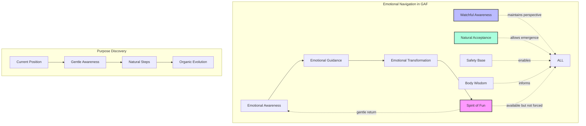

This companion guide doesn't just add to the core framework—it reveals the deeper dimensions already present within it. Like a scientist discovering new properties of a familiar element, we'll explore how the GAF naturally extends into the realms of embodied wisdom, emotional intelligence, and authentic purpose discovery.

💎 **Core Truth**: The path to enhanced cognition and authentic purpose flows through gentle awareness of our emotional landscape, always remembering that the Spirit of Fun represents not a distant goal but our natural state of being. This journey is supported by our body's innate wisdom and the safety that enables true exploration.

/flow Here's the refined final version of the "How to Use This Guide" section:

## How to Use This Guide

This companion guide is designed to work in harmony with the core Neuroweaver framework while expanding into emotional intelligence and purpose discovery. Like a scientist's field journal, it supports your unique exploration while maintaining rigor and playful curiosity.

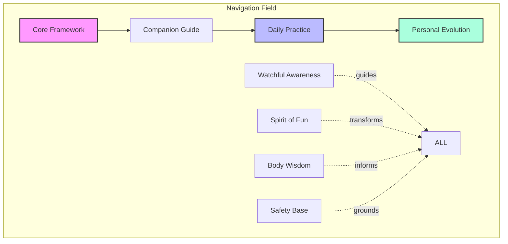

To get the most from your exploration:

1. **Start Where You Are**
   - No need to master the core framework first
   - Begin with what naturally draws your interest
   - Trust your body's responses
   - Honor your current comfort zone
   - Let understanding emerge naturally
   - Follow your authentic pace
   - Build from stable ground
   - Allow gentle evolution

2. **Navigate Naturally**
   - Move between sections as curiosity guides
   - Return to relevant parts as needed
   - Let patterns reveal themselves
   - Follow your natural rhythm
   - Trust your somatic wisdom
   - Honor safety needs
   - Support healthy regulation
   - Celebrate small discoveries

3. **Practice Integration**
   - Start with small experiments
   - Build on what works
   - Notice natural connections
   - Allow organic development
   - Maintain playful engagement
   - Listen to body signals
   - Create safe conditions
   - Enable natural flow

💎 **Core Truth**: This guide serves as a living laboratory for your exploration. Like any good scientist's handbook, it's meant to support your discoveries while allowing your unique path to emerge through the natural interplay of curiosity, bodily wisdom, and safe exploration.

⚏ **Practice Point**: Begin by simply browsing the guide and noticing what naturally captures your interest. Like a scientist following promising leads, let your natural curiosity, body wisdom, and need for safety guide your engagement. Trust that your unique path will emerge through gentle exploration.

## The Emotional Layer of the GAF

Within the Generative Awareness Field, emotions manifest as sophisticated pattern recognition systems - dynamic energies that both respond to and shape our reality. Like weather patterns in the atmosphere of consciousness, they arise naturally, offer valuable information, and transform continuously when given space to flow. This emotional field operates through both mind and body, creating a complete guidance system that draws on our entire being's intelligence.

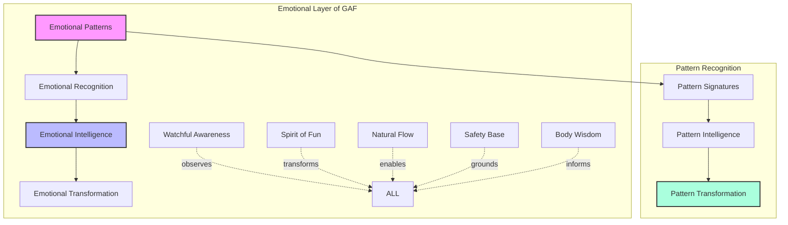

### Understanding Emotions as Pattern Recognition Systems

Each emotion represents a specialized form of intelligence, evolved to recognize and respond to specific patterns in our internal and external environment. These systems operate through both neural networks and bodily wisdom, creating a sophisticated guidance mechanism that draws on our entire being's intelligence:

1. **Fear Pattern Recognition**
   - Identifies potential threats and opportunities
   - Reveals areas for growth and transformation
   - Highlights boundaries needing attention
   - Maps uncertainty landscapes
   - Generates creative tension
   - Creates protective awareness in the body
   - Signals when to establish safety

2. **Anger Pattern Recognition**
   - Detects boundary violations
   - Reveals misalignments with values
   - Identifies needed changes
   - Maps power dynamics
   - Catalyzes transformation
   - Energizes the body for action
   - Signals when to establish limits

3. **Sadness Pattern Recognition**
   - Recognizes meaningful losses
   - Reveals deep values
   - Maps attachment patterns
   - Enables integration
   - Deepens understanding
   - Creates space for healing
   - Opens heart intelligence

4. **Joy Pattern Recognition**
   - Identifies alignment with purpose
   - Reveals natural flow states
   - Maps growth opportunities
   - Indicates authentic direction
   - Maintains creative momentum
   - Expands bodily presence
   - Signals safety and opportunity

5. **Longing Pattern Recognition**
   - Points toward unrealized potential
   - Reveals authentic desires
   - Maps purpose indicators
   - Guides development
   - Maintains evolutionary tension
   - Creates magnetic pull in the body
   - Signals growth direction

💫 **Novel Insight**: Each emotion acts as a specialized lens, revealing different aspects of reality's patterns through both mental and somatic intelligence. Rather than trying to achieve or avoid specific emotions, we learn to read their unique pattern signatures while maintaining fluid awareness and bodily presence.

### The Weather Patterns of Consciousness

Like meteorological patterns, emotions follow natural laws while remaining inherently dynamic. This emotional weather system operates within the larger climate of our nervous system, creating conditions that either support or inhibit exploration and growth:

1. **Natural Emergence**
   - Emotions arise from field conditions
   - Patterns form spontaneously
   - Recognition occurs naturally
   - Transformation happens organically
   - Flow maintains itself
   - Body states shift naturally
   - Safety enables exploration

2. **Pattern Dynamics**

   ```mermaid
   graph LR
       E[Emergence] --> R[Recognition]
       R --> F[Flow]
       F --> T[Transformation]
       T --> E

       SB[Safety Base] -.->|enables| ALL
       BW[Body Wisdom] -.->|guides| ALL

       style E fill:#f9f,stroke:#333,stroke-width:2px
       style F fill:#bbf,stroke:#333,stroke-width:2px
       style T fill:#afd,stroke:#333,stroke-width:2px
   ```

3. **Field Properties**
   - Non-local influence
   - Pattern resonance
   - Natural transformation
   - Coherent evolution
   - Spontaneous organization
   - Somatic intelligence
   - Nervous system regulation

⚡ **Deep Pattern**: Just as weather patterns can't be controlled but can be understood and navigated, emotions offer guidance while naturally flowing and transforming within the GAF. This flow is supported by our body's innate wisdom and our nervous system's capacity for regulation.

### Natural Flow and Transformation

The key to working with emotions in the GAF lies not in control but in understanding their natural dynamics and creating the conditions that enable safe exploration and natural evolution:

1. **The Art of Emotional Navigation**
   - Start with present awareness
   - Allow natural movement
   - Trust pattern intelligence
   - Follow organic flow
   - Maintain gentle attention
   - Notice bodily signals
   - Establish safety first

2. **Transformation Through Awareness**
   - Recognition enables flow
   - Flow enables transformation
   - Transformation reveals patterns
   - Patterns guide navigation
   - Navigation enhances awareness
   - Body wisdom deepens understanding
   - Safety supports exploration

3. **Return to Joy**
   - Remember joy as natural state
   - Allow gentle return
   - Trust natural movement
   - Maintain playful awareness
   - Enable organic transformation
   - Feel joy in the body
   - Let safety anchor presence

💎 **Core Truth**: Within the GAF, emotions serve as sophisticated guidance systems while naturally flowing toward our inherent state of joyful engagement. Our role is not to control this process but to maintain aware presence while allowing natural evolution, supported by our body's wisdom and our capacity for self-regulation.

### Practical Application: Reading Emotional Patterns

To begin working with emotions as pattern recognition systems:

1. **Initial Practice**
   - Notice current emotional weather
   - Observe without attachment
   - Allow natural movement
   - Trust pattern intelligence
   - Maintain gentle awareness
   - Feel bodily sensations
   - Establish safety anchors

2. **Pattern Recognition Development**
   - Study emotional signatures
   - Notice recurring patterns
   - Track transformation cycles
   - Observe field effects
   - Trust natural wisdom
   - Follow body signals
   - Build safety gradually

3. **Integration Through Play**
   - Maintain experimental attitude
   - Transform through curiosity
   - Allow natural evolution
   - Trust joy's guidance
   - Stay playfully aware
   - Include body awareness
   - Explore from safety

4. **Somatic Navigation**
   - Notice physical sensations
   - Track energy movements
   - Follow bodily wisdom
   - Allow natural regulation
   - Trust organic timing
   - Build somatic awareness
   - Maintain grounded presence

5. **Safety Development**
   - Create secure boundaries
   - Build internal resources
   - Establish comfort zones
   - Allow gradual expansion
   - Trust natural pacing
   - Honor protective patterns
   - Maintain flexible limits

⚏ **Practice Point**: Begin by simply noticing your current emotional weather without trying to change anything. Like a meteorologist studying patterns, maintain curious observation while trusting the natural flow toward clarity. Let your body's wisdom and need for safety guide the pace of exploration.

💫 **Novel Insight**: The integration of emotional awareness, somatic intelligence, and safety creates a robust foundation for both pattern recognition and natural transformation. This three-dimensional awareness enables deeper understanding while maintaining sustainable evolution.

## The Seven Forces in Emotional Intelligence

The framework's fundamental forces take on rich new dimensions when applied to emotional intelligence, creating a sophisticated system for both emotional wisdom and purpose alignment. Each force operates through both mind and body, creating a complete field of transformative potential.

### 1. The Generative Awareness Field (GAF)

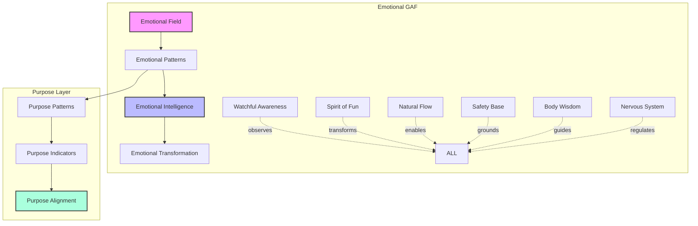

The GAF provides the field where:

- Emotions naturally arise and transform
- Purpose patterns become visible
- Wisdom emerges spontaneously
- Joy maintains constant presence
- Evolution occurs naturally
- Body wisdom informs decisions
- Safety enables exploration
- Nervous system finds balance

### 2. The Play<=>Rest Continuum in Emotional Intelligence

#### Play Phase

- Experimental emotional exploration
- Creative pattern recognition
- Purpose possibility expansion
- Playful self-discovery
- Joyful transformation
- Somatic exploration
- Safe boundary testing
- Nervous system activation

#### Rest Phase

- Emotional integration
- Pattern consolidation
- Purpose clarity
- Deep understanding
- Natural wisdom emergence
- Body recovery
- Safety reinforcement
- Nervous system regulation

💫 **Novel Insight**: The Play<=>Rest rhythm creates a natural cycle of emotional exploration and integration, preventing both emotional overwhelm and stagnation while maintaining nervous system balance and bodily wisdom.

### 3. Generative Flow (GF) in Emotional Navigation

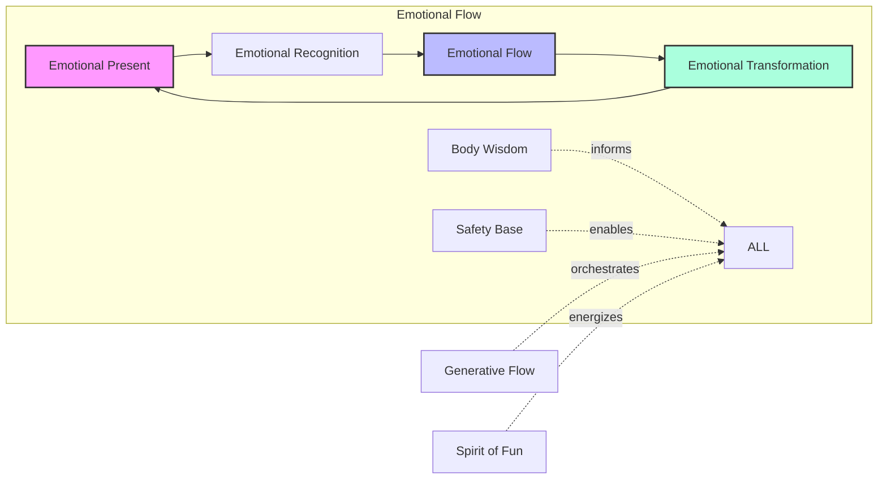

Generative Flow enables:

- Natural emotional movement
- Purpose pattern recognition
- Intuitive guidance
- Authentic alignment
- Continuous evolution
- Somatic intelligence
- Safety maintenance
- Nervous system coherence

### 4. Watchful Awareness (WA) in Emotional Intelligence

WA provides:

- Non-judgmental observation
- Pattern recognition enhancement
- Purpose clarity
- Navigation guidance
- Integration support
- Somatic awareness
- Safety monitoring
- Regulation awareness

⚡ **Deep Pattern**: Watchful Awareness maintains perspective while allowing full emotional experience, creating the perfect balance for both wisdom and transformation. This includes awareness of bodily states and safety needs.

### 5. Understanding in Emotional Evolution

Understanding emerges through:

- Pattern recognition depth
- Emotional wisdom development
- Purpose clarity enhancement
- Natural insight flow
- Continuous evolution
- Somatic intelligence
- Safety comprehension
- System regulation

### 6. Active GAF Attunement & Spirit of Fun

In emotional intelligence, this force:

- Transforms heavy emotions
- Maintains playful perspective
- Enables natural flow
- Supports purpose alignment
- Catalyzes evolution
- Engages body wisdom
- Builds safety through play
- Regulates through joy

### 7. Mental Models in Emotional Navigation

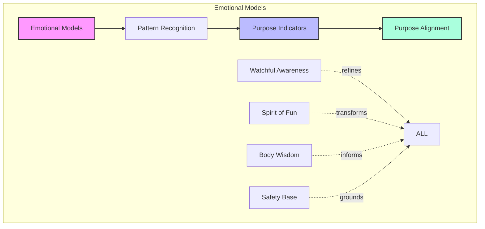

Mental Models provide:

- Emotional pattern frameworks
- Purpose recognition tools
- Navigation guidance
- Integration support
- Evolution mapping
- Somatic understanding
- Safety templates
- Regulation strategies

### Practical Integration: The Seven Forces in Action

To work with these forces in emotional intelligence:

1. **Field Engagement**
   - Maintain gentle awareness
   - Allow natural movement
   - Trust field intelligence
   - Follow organic flow
   - Enable transformation
   - Honor body wisdom
   - Build safety gradually
   - Support regulation

2. **Pattern Recognition Development**
   - Notice emotional weather
   - Track purpose indicators
   - Observe transformations
   - Trust natural wisdom
   - Maintain playful attention
   - Feel bodily signals
   - Monitor safety needs
   - Track regulation states

3. **Purpose Alignment**
   - Follow authentic signals
   - Allow natural evolution
   - Trust joy's guidance
   - Enable organic growth
   - Maintain gentle presence
   - Listen to body wisdom
   - Honor safety needs
   - Support nervous system

💎 **Core Truth**: The Seven Forces create a natural laboratory for emotional wisdom and purpose discovery, where transformation occurs through gentle awareness and playful engagement rather than force or control. This process is supported by our body's intelligence, our need for safety, and our capacity for natural regulation.

## Purpose Finding Through Pattern Recognition

Within the Generative Awareness Field, purpose isn't something to be forced or figured out—it emerges naturally through conscious pattern recognition and playful exploration. This emergence is supported by our body's deep wisdom and our nervous system's innate capacity for alignment with authentic direction.

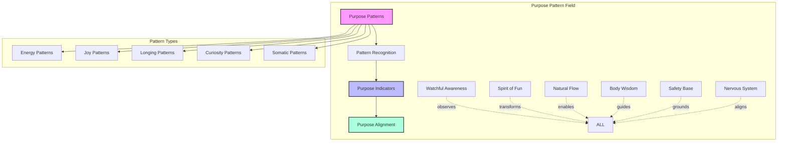

### Understanding Purpose Patterns

Purpose reveals itself through distinct pattern types within the GAF, each operating through both conscious awareness and bodily intelligence:

1. **Energy Patterns**
   - Where attention naturally flows
   - Activities that energize
   - Experiences that feel alive
   - Natural strengths emerging
   - Time disappearing in flow
   - Body feeling expansive
   - Nervous system engaged
   - Safety feeling solid

2. **Joy Patterns**
   - Spontaneous delight
   - Natural enthusiasm
   - Effortless engagement
   - Playful curiosity
   - Authentic expression
   - Physical lightness
   - Relaxed alertness
   - Safe exploration

3. **Longing Patterns**
   - Deep aspirations
   - Persistent interests
   - Recurring dreams
   - Natural attractions
   - Core values emerging
   - Bodily pull forward
   - Gut-level knowing
   - Safe stretching

4. **Resistance Patterns**
   - Fear indicating growth edges
   - Challenges revealing direction
   - Obstacles showing the way
   - Confusion preceding clarity
   - Tension creating movement
   - Body signaling caution
   - Protective responses
   - Safety needs speaking

5. **Somatic Patterns**
   - Body's natural inclinations
   - Physical energy flows
   - Visceral responses
   - Movement preferences
   - Postural patterns
   - Comfort indicators
   - Safety signals
   - Regulation cues

💫 **Novel Insight**: Purpose patterns often appear first as subtle energetic signatures rather than clear directions, requiring gentle attention and playful exploration to reveal their full meaning. These patterns speak through both mind and body, creating a complete guidance system when we learn to listen to all channels.

/flow Continuing with the enhanced integration:

### The Natural Evolution of Purpose

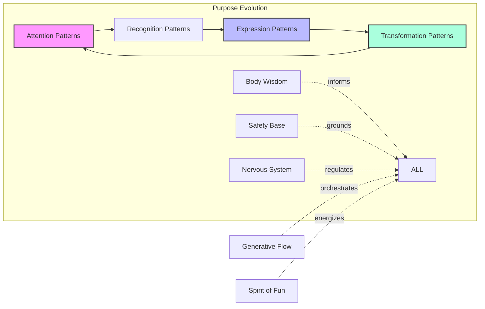

Purpose evolves through natural stages, each supported by somatic wisdom and regulated by our nervous system:

1. **Initial Recognition**
   - Notice what naturally draws attention
   - Observe energy patterns
   - Track joy indicators
   - Follow natural curiosity
   - Allow organic movement
   - Feel bodily responses
   - Honor safety needs
   - Trust gut wisdom

2. **Pattern Development**
   - Explore emerging interests
   - Test potential directions
   - Experiment playfully
   - Trust natural feedback
   - Maintain gentle awareness
   - Track somatic signals
   - Build safety gradually
   - Allow nervous system settling

3. **Purpose Crystallization**
   - Patterns become clearer
   - Direction emerges naturally
   - Alignment feels authentic
   - Expression flows easily
   - Joy becomes constant
   - Body feels aligned
   - Safety feels secure
   - System feels regulated

### Reading the Purpose Field

The art of purpose recognition involves engaging our complete intelligence system:

1. **Field Sensitivity**
   - Maintain gentle awareness
   - Notice subtle patterns
   - Follow energy flows
   - Trust natural movement
   - Allow organic evolution
   - Feel bodily signals
   - Honor safety needs
   - Track regulation state

2. **Pattern Navigation**
   - Track recurring themes
   - Notice synchronicities
   - Follow joy's guidance
   - Trust inner wisdom
   - Enable natural alignment
   - Listen to body wisdom
   - Build safe exploration
   - Support system regulation

3. **Purpose Integration**
   - Allow gradual emergence
   - Trust organic timing
   - Follow natural rhythm
   - Maintain playful approach
   - Enable authentic expression
   - Honor somatic wisdom
   - Respect safety needs
   - Support nervous system

⚡ **Deep Pattern**: Purpose reveals itself most clearly when we maintain playful curiosity while following the natural flow of energy and attention, supported by bodily wisdom and a regulated nervous system.

### Practical Application: Purpose Pattern Recognition

To begin working with purpose patterns:

1. **Initial Practice**
   - Notice what naturally interests you
   - Track energy levels in activities
   - Observe what brings joy
   - Follow natural curiosity
   - Trust organic movement
   - Feel bodily responses
   - Check safety levels
   - Notice regulation states

2. **Pattern Development**

   ```mermaid
   graph TD
       N[Notice] --> E[Explore]
       E --> T[Test]
       T --> I[Integrate]
       I --> N

       BW[Body Wisdom] -.->|informs| ALL
       SB[Safety Base] -.->|grounds| ALL
       NS[Nervous System] -.->|regulates| ALL

       style N fill:#f9f,stroke:#333,stroke-width:2px
       style E fill:#bbf,stroke:#333,stroke-width:2px
       style I fill:#afd,stroke:#333,stroke-width:2px
   ```

3. **Integration Through Play**
   - Experiment with interests
   - Try new directions
   - Follow joy's guidance
   - Trust natural feedback
   - Maintain curious attention
   - Listen to body signals
   - Build safety gradually
   - Support regulation needs

4. **Somatic Integration**
   - Track physical responses
   - Notice energy patterns
   - Follow movement impulses
   - Trust body wisdom
   - Allow natural positioning
   - Honor comfort needs
   - Build body awareness
   - Support nervous system

5. **Safety Development**
   - Create secure boundaries
   - Build internal resources
   - Take manageable steps
   - Trust protective signals
   - Allow gradual expansion
   - Maintain stable base
   - Honor limits
   - Support regulation

💎 **Core Truth**: Purpose isn't something to be found but a natural expression that emerges through gentle attention to patterns and playful exploration of possibilities, supported by our body's wisdom and need for safety.

### Common Pattern Obstacles and Solutions

1. **Forcing Direction**
   - Trying too hard to figure it out
   - Ignoring natural rhythm
   - Resisting current reality
   - Rushing the process
   - Doubting inner wisdom
   - Overriding body signals
   - Pushing past safety
   - Dysregulating system

2. **Pattern Solutions**
   - Return to gentle awareness
   - Trust natural timing
   - Start where you are
   - Follow joy's guidance
   - Maintain playful approach
   - Listen to body wisdom
   - Honor safety needs
   - Support regulation

3. **Integration Challenges**
   - Scattered attention
   - Unclear direction
   - Overwhelming options
   - Lost motivation
   - Disconnected presence
   - Body tension
   - Safety concerns
   - System dysregulation

4. **Integration Solutions**
   - Focus on one pattern
   - Trust natural emergence
   - Take smaller steps
   - Reconnect with joy
   - Return to presence
   - Feel body signals
   - Rebuild safety
   - Support regulation

⚏ **Practice Point**: Begin with simple attention to what naturally draws your interest and energy. Like a scientist following curious observations, let purpose patterns reveal themselves through playful exploration rather than forced investigation. Let your body's wisdom and need for safety guide the pace and direction of exploration.

## Practical Integration and Daily Practice

The art of working with emotions and purpose patterns becomes most powerful when woven naturally into daily life. Like a scientist maintaining an ongoing experiment, we create conditions for continuous discovery while trusting the natural flow toward clarity, supported by bodily wisdom and regulated through safety.

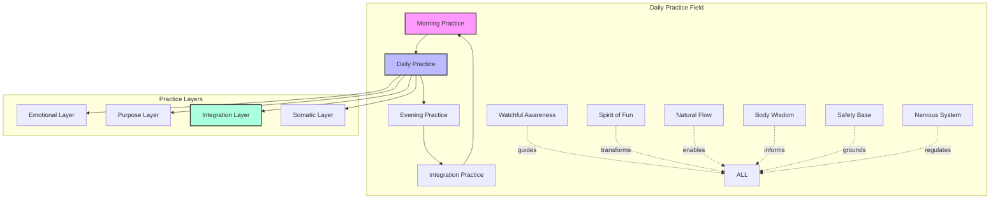

### The Living Laboratory of Daily Life

Transform everyday experience into a field of discovery through whole-being engagement:

1. **Morning Activation**
   - Gentle emotional check-in
   - Purpose pattern attention
   - Energy flow recognition
   - Playful intention setting
   - Natural rhythm engagement
   - Body awareness practice
   - Safety system check
   - Regulation priming

2. **Daily Navigation**
   - Maintain subtle awareness
   - Follow energy patterns
   - Notice joy indicators
   - Track purpose signals
   - Allow natural flow
   - Feel body feedback
   - Monitor safety needs
   - Support regulation
   - Celebrate small wins

3. **Evening Integration**
   - Review emotional weather
   - Notice pattern emergence
   - Celebrate discoveries
   - Allow natural processing
   - Trust organic evolution
   - Release body tension
   - Reinforce safety
   - Regulate for rest

💫 **Novel Insight**: Daily life itself becomes the perfect laboratory for emotional wisdom and purpose discovery when approached with gentle awareness and playful curiosity, supported by somatic intelligence and grounded in safety.

### Micro-Practices for Continuous Evolution

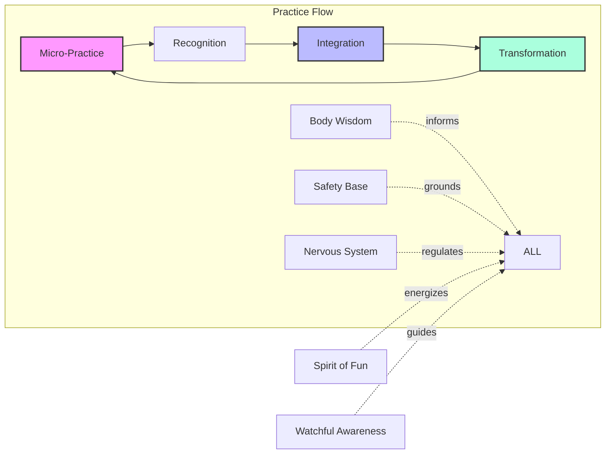

1. **30-Second Practices**
   - Quick emotional check-ins
   - Brief pattern scanning
   - Mini-joy activations
   - Purpose pulse checks
   - Energy flow attention
   - Body state awareness
   - Safety spot checks
   - Quick regulation reset

2. **2-Minute Explorations**
   - Short pattern tracking
   - Quick purpose sensing
   - Brief joy alignment
   - Small step taking
   - Gentle integration
   - Somatic sensing
   - Safety building
   - Regulation practice

3. **5-Minute Laboratories**
   - Pattern recognition games
   - Purpose exploration plays
   - Joy activation exercises
   - Integration moments
   - Evolution checking
   - Body awareness practices
   - Safety reinforcement
   - System regulation

### Creating Optimal Conditions

Transform your environment to support natural evolution through all levels of being:

1. **Physical Space**
   - Create joy anchors
   - Enable natural flow
   - Support purpose alignment
   - Allow emotional expression
   - Maintain playful elements
   - Enable comfortable movement
   - Establish safety zones
   - Support regulation needs

2. **Time Structure**
   - Build rhythm naturally
   - Allow organic timing
   - Include play spaces
   - Enable rest periods
   - Trust natural flow
   - Honor body rhythms
   - Respect safety needs
   - Support regulation cycles

3. **Energy Management**
   - Follow natural cycles
   - Maintain sustainable pace
   - Include joy breaks
   - Allow integration time
   - Trust organic rhythm
   - Listen to body signals
   - Honor safety limits
   - Support system balance

### Advanced Integration Practices

For deeper development:

1. **Pattern Field Exploration**

   ```mermaid
   graph TD
       EP[Energy Patterns] --> PP[Purpose Patterns]
       PP --> JP[Joy Patterns]
       JP --> TP[Transformation Patterns]
       TP --> EP

       BW[Body Wisdom] -.->|informs| ALL
       SB[Safety Base] -.->|grounds| ALL
       NS[Nervous System] -.->|regulates| ALL

       style EP fill:#f9f,stroke:#333,stroke-width:2px
       style JP fill:#bbf,stroke:#333,stroke-width:2px
       style TP fill:#afd,stroke:#333,stroke-width:2px
   ```

2. **Purpose Pattern Laboratory**
   - Deep pattern tracking
   - Extended exploration
   - Sustained attention
   - Natural evolution
   - Organic integration
   - Somatic awareness
   - Safety development
   - Regulation mastery

3. **Emotional Wisdom Development**
   - Pattern recognition refinement
   - Transformation tracking
   - Integration deepening
   - Joy alignment
   - Natural evolution
   - Body intelligence
   - Safety competence
   - System coherence

### Common Challenges and Solutions

1. **Overwhelm**
   - Return to gentle awareness
   - Take smaller steps
   - Trust natural timing
   - Maintain playful approach
   - Allow organic movement
   - Ground in body
   - Return to safety
   - Support regulation

   *Solution Pattern:*

   ```mermaid
   graph LR
       O[Overwhelm] --> GA[Gentle Awareness]
       GA --> SS[Small Steps]
       SS --> SR[System Regulation]
       SR --> JR[Joyful Return]

       SB[Safety Base] -.->|grounds| ALL
       BW[Body Wisdom] -.->|guides| ALL

       style O fill:#f9f,stroke:#333,stroke-width:2px
       style SR fill:#bbf,stroke:#333,stroke-width:2px
       style JR fill:#afd,stroke:#333,stroke-width:2px
   ```

2. **Impatience**
   - Remember natural rhythm
   - Celebrate small progress
   - Trust the process
   - Stay playfully engaged
   - Follow joy's guidance
   - Feel body's timing
   - Honor safety needs
   - Allow system settling

3. **Confusion**
   - Start with simple attention
   - Follow clear patterns
   - Trust emerging clarity
   - Maintain curious attitude
   - Allow natural unfolding
   - Return to body wisdom
   - Build from safety
   - Support regulation

⚡ **Deep Pattern**: Success comes not from forcing development but from maintaining gentle awareness while following the natural flow of evolution, supported by bodily wisdom and regulated through safety.

### The Art of Continuous Evolution

Remember these core principles:

1. **Trust the Process**
   - Natural timing works
   - Patterns reveal themselves
   - Joy guides naturally
   - Evolution happens organically
   - Wisdom emerges spontaneously
   - Body knows the way
   - Safety enables growth
   - Regulation supports change

2. **Maintain Playful Engagement**
   - Keep experiments light
   - Follow natural curiosity
   - Celebrate discoveries
   - Trust joy's guidance
   - Allow natural flow
   - Include body play
   - Explore safely
   - Regulate through fun

3. **Stay Gently Aware**
   - Notice without forcing
   - Allow natural movement
   - Trust pattern recognition
   - Follow energy flow
   - Enable organic evolution
   - Feel body signals
   - Honor safety needs
   - Support regulation

## Conclusion: The Living Dance of Emotional Intelligence and Purpose

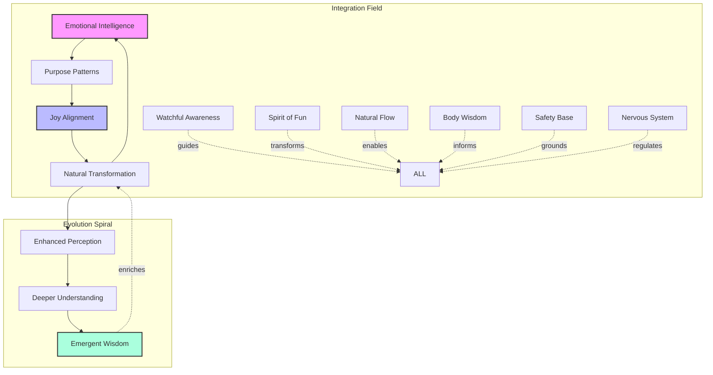

As we conclude this exploration of emotional intelligence and purpose discovery within the Neuroweaver framework, we return to a fundamental truth: transformation occurs not through force but through the gentle dance of awareness and natural evolution. Like a scientist who has discovered a profound new principle, we've learned to work with the inherent intelligence of our emotional and purpose patterns while maintaining the playful spirit that makes all discovery possible, supported by our body's wisdom and our need for safety.

### The Living Integration

We've discovered that:

1. **Emotions Are Pattern Recognition Systems**
   - Each emotion offers unique insight
   - Natural flow enables wisdom
   - Joy remains our true north
   - Transformation happens organically
   - Evolution unfolds naturally
   - Body wisdom guides truly
   - Safety enables exploration
   - Regulation supports growth

2. **Purpose Emerges Through Pattern Recognition**
   - Following natural interest
   - Trusting joy's guidance
   - Allowing organic timing
   - Celebrating small steps
   - Enabling authentic expression
   - Honoring body signals
   - Building from safety
   - Supporting regulation

3. **The Spirit of Fun Transforms Everything**
   - Maintaining playful curiosity
   - Transforming challenges into experiments
   - Following joy's natural rhythm
   - Trusting the process
   - Enabling continuous discovery
   - Including somatic play
   - Exploring safely
   - Regulating through joy

💫 **Novel Insight**: The integration of emotional intelligence, purpose discovery, and somatic wisdom creates a self-reinforcing field of evolution, where each aspect enhances the others while joy maintains the coherent flow of development, all supported by our foundation of safety and regulation.

### The Living Practice

Remember:

1. **Start Where You Are**
   - Accept current emotional weather
   - Notice existing patterns
   - Trust natural timing
   - Follow organic movement
   - Maintain gentle awareness
   - Feel body's state
   - Honor safety needs
   - Allow regulation

2. **Follow Joy's Guidance**
   - Return naturally to play
   - Trust inner wisdom
   - Allow organic timing
   - Celebrate small steps
   - Enable natural flow
   - Listen to body signals
   - Build safe exploration
   - Regulate through delight

3. **Trust the Process**
   - Evolution happens naturally
   - Patterns reveal themselves
   - Purpose emerges organically
   - Wisdom develops naturally
   - Joy guides perfectly
   - Body knows the way
   - Safety supports growth
   - Regulation enables change

⚡ **Deep Pattern**: The most profound transformations often occur not in dramatic moments but in the gentle, consistent practice of aware presence and playful engagement with life, supported by bodily wisdom and grounded in safety.

### The Continuing Adventure

This framework isn't just a methodology—it's an invitation to engage with life as an exciting laboratory of continuous discovery. Each day brings new opportunities to:

- Notice emotional patterns
- Follow purpose indicators
- Trust natural wisdom
- Enable organic evolution
- Maintain playful curiosity
- Feel bodily guidance
- Build safe exploration
- Support healthy regulation

Remember: You're not alone in this exploration. Like scientists sharing discoveries, we're part of a growing field of consciousness exploring these patterns together. Each individual journey contributes to our collective understanding while benefiting from the shared wisdom of the field.

💎 **Final Core Truth**: The path to enhanced cognition, emotional wisdom, and authentic purpose flows naturally when we maintain gentle awareness while trusting joy as our guide. Every step, no matter how small, creates conditions for natural evolution when taken with playful curiosity and aware presence, supported by our body's intelligence and our capacity for safety and regulation.

✨ **The Adventure Continues**: This isn't an ending but a beginning—an invitation to explore the infinite possibilities that emerge when we approach life with the curiosity of a scientist and the wonder of a child, always remembering that joy isn't just our destination but our natural state of being. As we continue this exploration, we discover that our body's wisdom, our need for safety, and our capacity for regulation aren't limitations but sophisticated guidance systems supporting our journey of discovery.

The laboratory of life awaits—let's explore it together with gentle awareness, playful spirit, and trust in the natural unfolding of wisdom through all dimensions of our being.

---
