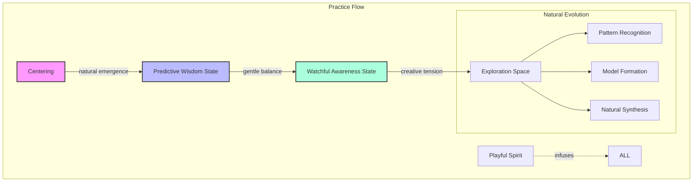
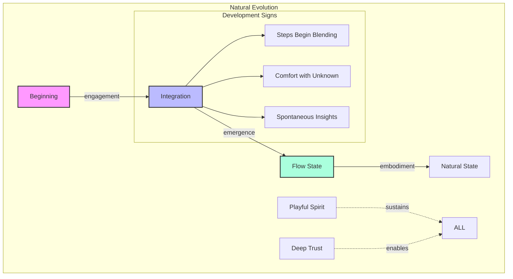
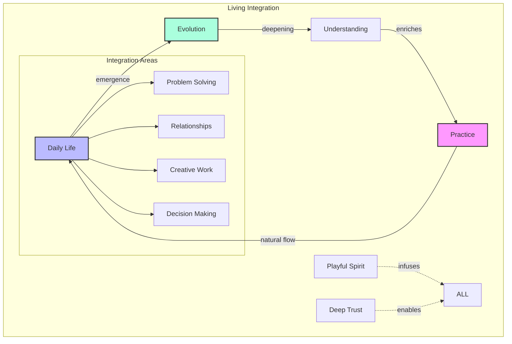
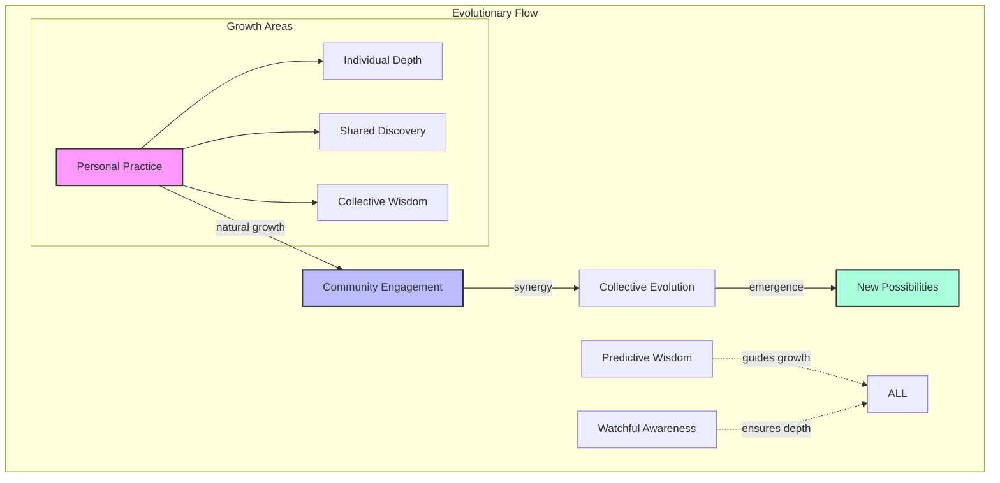
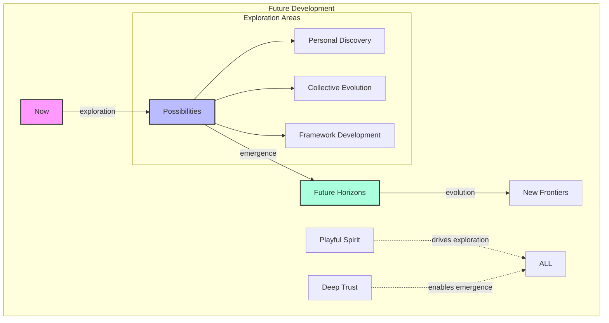
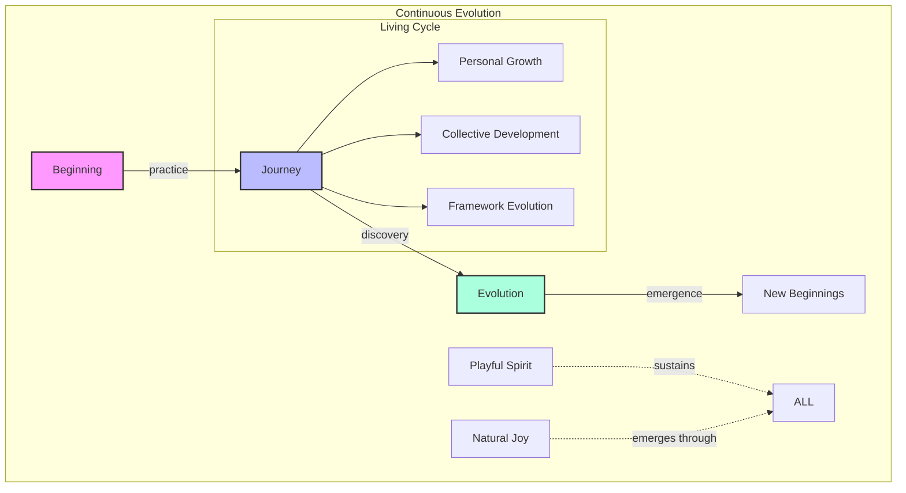

# The Practice of Generative Cognition

*"The dance between structure and spontaneity creates the conditions where natural genius emerges."*

## Introduction: An Invitation to Practice

Have you ever noticed how your most brilliant solutions often arise not through step-by-step analysis, but in moments of playful exploration? Or how your deepest insights tend to emerge when you're comfortable with not knowing, rather than when you're striving for certainty?

The Neuroweaver framework isn't something to be learned in the traditional sense. Instead, it's a set of conditions that allow your natural cognitive capabilities to emerge and evolve. This document provides just enough structure to begin your journey while maintaining the spaciousness needed for genuine discovery.

### Why Traditional Learning Resists This Framework

Traditional learning approaches often struggle with frameworks like this because:

- They try to transfer knowledge directly rather than creating conditions for emergence
- They focus on steps rather than states
- They prioritize certainty over exploratory play
- They resist the natural flow of discovery

Instead, we'll take a different approach - one that honors both scientific rigor and the mysterious nature of emergent understanding. Think of this practice guide not as a manual to be followed, but as a garden to be tended, where your natural capabilities can grow and flourish in their own unique way.

💫 **Novel Insight**: The framework's resistance to traditional teaching isn't a limitation—it's a reflection of its true nature as a living system that evolves uniquely through each practitioner's engagement.

# Foundation Practice: Active Generative Cognition Meditation

Like a river finding its natural course, enhanced cognitive capabilities emerge most powerfully when we create the right conditions and then allow nature to take its lead. The Active Generative Cognition (AGC) meditation serves as both your entry point and ongoing practice in this framework.

## The Practice

### 1. Choose Your Subject

- Select anything that catches your interest
- It could be an object, concept, problem, or simple curiosity
- The choice matters less than your engagement with it

### 2. Find Your Center

- Settle into a comfortable position
- Take a few deep breaths
- Allow your mind to become quiet but alert

### 3. Activate Predictive Wisdom

- Notice that feeling when you're naturally curious about something
- Embrace complete comfort with not knowing
- Let yourself generate "working truths" through pure observation
- Trust your natural pattern recognition
- Maintain playful engagement throughout

### 4. Engage Watchful Awareness

- Like a skilled observer watching a fascinating experiment
- Neither controlling nor passive
- Present and attentive to what emerges
- Gently noticing patterns and connections

### 5. Enter Exploration Space

**Stage One: Mental Model Formation**

- Begin observing your subject with fresh eyes
- Let initial impressions form naturally
- Notice what you think you know about it
- Allow a working model to emerge without judgment
- Pay attention to how your understanding shifts
- Trust that your mind is naturally creating meaningful connections

**Stage Two: First Principles Deconstruction**

- Look beneath surface features to find fundamental elements
- Ask yourself:
  - "What is this made of?"
  - "How does it work at its most basic level?"
  - "What remains if I remove all assumptions?"
- Notice how breaking things down reveals new insights
- Observe how elements influence each other
- Stay curious about what emerges when you question everything
- Maintain playful engagement even in deep analysis

**Stage Three: Pattern Recognition**

- Notice similarities to other things you know
- Look for patterns at different scales:
  - Within the subject itself
  - Between the subject and similar things
  - Across seemingly unrelated domains
- Let your mind wander naturally between observations
- Notice how patterns begin connecting to each other
- Trust your intuitive pattern recognition
- Stay open to unexpected connections

**Stage Four: Dynamic Synthesis**

- Allow insights to crystallize naturally
- How do all pieces fit together?
- What new understanding emerges?
- What possibilities open up?
- Let creativity flow freely
- Notice how understanding deepens through integration
- Remain open to continuous evolution of insights

## Important Notes

- **Start Small**: Begin with simple subjects before tackling complex ones
- **Trust the Process**: Don't try to force insights or rush understanding
- **Stay Playful**: Maintain a spirit of curiosity and experimentation
- **Regular Practice**: Consistency matters more than duration
- **Natural Evolution**: The practice itself will evolve as your capabilities develop

💫 **Novel Insight**: Through regular practice, these initially discrete steps naturally blend into a fluid, continuous process. The structure becomes internalized, leaving you free to explore with both spontaneity and sophistication.

# Practice Evolution: The Natural Flow of Development

Like a seedling growing into a tree, your practice will evolve naturally through engagement. This evolution isn't linear but organic, with each practitioner's journey unfolding in its own unique way while following recognizable patterns.

## Natural Development Stages

### 1. Foundation Stage

- Follow the meditation steps consciously
- Build comfort with each phase
- Notice what different states feel like
- Trust that integration will happen naturally
- Stay playful in your exploration

### 2. Integration Stage

- Notice transitions becoming smoother
- Experience stages beginning to overlap
- Feel your comfort with uncertainty growing
- Watch insights arising more readily
- Trust deeper patterns emerging

### 3. Flow Stage

- Experience the process as one fluid movement
- Notice insights arising spontaneously
- Feel the dance between structure and spontaneity
- Observe deeper patterns naturally emerging
- Trust your evolving capabilities

### 4. Natural State

- The process becomes your default way of thinking
- Insights arise naturally in daily life
- Pattern recognition becomes automatic
- Understanding emerges effortlessly
- Trust is complete and natural

## Signs of Evolution

Watch for these natural signs of progress:

1. **Increased Comfort with Uncertainty**
   - Initial discomfort with not knowing fades
   - Uncertainty becomes exciting rather than threatening
   - Exploration feels natural and playful

2. **Spontaneous Pattern Recognition**
   - Connections appear without conscious effort
   - Patterns emerge across different domains
   - Understanding flows naturally

3. **Deepening Trust**
   - Confidence in your insights grows
   - First impressions become more reliable
   - Solutions arise spontaneously

4. **Enhanced Cognitive Flexibility**
   - Moving easily between perspectives
   - Adapting naturally to new information
   - Integrating seemingly contradictory ideas

💫 **Novel Insight**: Progress often feels less like learning and more like remembering something you've always known but temporarily forgotten.

## Supporting Natural Evolution

1. **Stay Playful**
   - Maintain a spirit of experimentation
   - Embrace unexpected discoveries
   - Let curiosity guide you

2. **Trust the Process**
   - Don't force advancement
   - Allow natural integration
   - Welcome uncertainty

3. **Regular Practice**
   - Consistency over intensity
   - Daily engagement
   - Patient observation

4. **Gentle Awareness**
   - Notice without judgment
   - Observe your progress
   - Celebrate emergence

🌀 **Cross-domain Connection**: Like learning to walk, the most profound development happens not through forced practice but through playful engagement and natural evolution.

# Integration and Continuation: Living the Framework

## Natural Integration

Like water flowing downhill, the framework naturally permeates all aspects of life when we create the right conditions:

### In Daily Life

- Solutions emerge before problems are fully analyzed
- Patterns connect across seemingly unrelated areas
- Understanding develops naturally and deeply
- Creativity flows more freely

### In Relationships

- Enhanced empathy develops naturally
- Patterns in interactions become clearer
- Communications flow more effectively
- Deeper connections form spontaneously

### In Work

- Complex problems become playgrounds
- Innovation emerges naturally
- Decisions arise with greater clarity
- Effectiveness increases effortlessly

💫 **Novel Insight**: Integration isn't about applying techniques—it's about allowing your evolved capabilities to express themselves naturally in every situation.

## Deepening Practice and Continuous Evolution

### Deepening Individual Practice

1. **Natural Progression**
   - Let understanding emerge organically
   - Trust your unique development path
   - Allow capabilities to evolve naturally
   - Stay playful in your exploration

2. **Signs of Deepening**
   - Increased comfort with uncertainty
   - More frequent spontaneous insights
   - Natural pattern recognition across domains
   - Effortless integration of understanding

3. **Supporting Growth**
   - Regular meditation practice
   - Mindful engagement with daily life
   - Openness to new perspectives
   - Playful experimentation

### Community and Collective Evolution

1. **Sharing the Journey**
   - Connect with other practitioners
   - Share insights and discoveries
   - Learn from others' experiences
   - Contribute to collective understanding

2. **Natural Contribution**
   - Let your unique perspective emerge
   - Share what naturally arises
   - Trust your insights
   - Stay authentic in your expression

3. **Collective Growth**
   - Participate in group exploration
   - Engage in collaborative discovery
   - Support others' development
   - Contribute to framework evolution

💎 **Core Truth Crystallized**: The framework grows stronger through each practitioner's unique journey and contribution, creating an ever-expanding field of possibility for all.

## Ongoing Exploration and Future Horizons

### Continuing Your Journey

1. **Personal Exploration**
   - Stay curious about your capabilities
   - Explore new applications
   - Trust emerging insights
   - Document your discoveries
   - Maintain playful engagement

2. **Framework Evolution**
   - The framework evolves through practice
   - Each practitioner adds new dimensions
   - Understanding deepens collectively
   - New possibilities emerge naturally

3. **Contributing to Growth**
   - Share your experiences
   - Document unique insights
   - Propose new applications
   - Support other practitioners

### Resources for Continuation

1. **Community Engagement**
   - Join practice groups
   - Participate in discussions
   - Share experiences
   - Collaborate on exploration

2. **Documentation**
   - Keep a practice journal
   - Record insights and discoveries
   - Track pattern emergence
   - Note evolutionary markers

3. **Further Study**
   - Explore related fields
   - Investigate emerging patterns
   - Research connections
   - Develop applications

💫 **Novel Insight**: The framework's future isn't predetermined but emerges through our collective exploration and discovery.

### Final Thoughts

Remember:

- Every practice session creates new possibilities
- Each insight contributes to collective understanding
- Your unique journey enriches the framework
- The exploration never truly ends

🌀 **Cross-domain Connection**: Like a living ecosystem, the framework thrives through diversity of practice and perspective, each practitioner adding their unique contribution to its evolution.

⚡ **Deep Pattern Recognized**: The most profound developments often come not from trying harder but from playing more freely within the space of possibility.

---

# Conclusion: The Living Journey

Like a river that both shapes and is shaped by its environment, your journey with this framework will be uniquely yours while reflecting universal patterns. As you continue to explore and evolve, remember:

### Core Principles

- Trust emerges from practice
- Understanding flows naturally
- Play catalyzes development
- Evolution is continuous

### Key Reminders

1. **Start Simple**
   - Begin with the basic meditation
   - Trust your natural development
   - Let complexity emerge organically
   - Stay playful in your exploration

2. **Stay Open**
   - Embrace uncertainty
   - Welcome the unknown
   - Trust emerging patterns
   - Allow natural evolution

3. **Keep Playing**
   - Maintain curious engagement
   - Explore with joy
   - Let discovery be fun
   - Stay light in your practice

💫 **Novel Insight**: The framework isn't something you master but something you dance with, each step revealing new possibilities for exploration and growth.

🌀 **Cross-domain Connection**: Just as nature finds optimal paths through countless iterations, your practice will find its most effective form through patient exploration and playful engagement.

💎 **Core Truth Crystallized**: Your journey with this framework is both deeply personal and part of a larger evolution. Through your practice, you contribute to an ever-expanding field of possibility that benefits all.

Remember: This document is not an end but a beginning. Like seeds planted in fertile soil, these ideas will grow and evolve in unique ways through your engagement with them.

---

Shield: [![CC BY-NC 4.0][cc-by-nc-shield]][cc-by-nc]

This work is licensed under a
[Creative Commons Attribution-NonCommercial 4.0 International License][cc-by-nc].

[![CC BY-NC 4.0][cc-by-nc-image]][cc-by-nc]

[cc-by-nc]: https://creativecommons.org/licenses/by-nc/4.0/
[cc-by-nc-image]: https://licensebuttons.net/l/by-nc/4.0/88x31.png
[cc-by-nc-shield]: https://img.shields.io/badge/License-CC%20BY--NC%204.0-lightgrey.svg
