# Neuroweaver
*v0.1.2-emergence*
**A powerful framework for weaving structured thinking and creative emergence into breakthrough discoveries**

*Discovered rather than designed, Neuroweaver represents a fundamental reimagining of human-AI interaction. This is not another prompt engineering framework - it's a natural methodology that consistently produces extraordinary results by enhancing both human and artificial intelligence through their dynamic interplay.*

by: Phillip Clapham

## Table of Contents
- [A Pattern Emerges](#a-pattern-emerges)
- [The Framework](#the-framework)
- [Learning the Dance](#learning-the-dance)
  - [Quick Start Guide](#quick-start-guide)
  - [The Natural Flow of Discovery](#the-natural-flow-of-discovery)
- [The Patterns Within Patterns](#the-patterns-within-patterns)
  - [Pattern Recognition Across Domains](#pattern-recognition-across-domains)
  - [Recursive Pattern Discovery](#recursive-pattern-discovery)
- [The Dance in Practice](#the-dance-in-practice)
  - [Case Study: System Design](#case-study-system-design)
  - [Practical Applications](#practical-applications)
  - [Visual Pattern Language](#visual-pattern-language)
    - [Dynamic Pattern Networks](#dynamic-pattern-networks)
    - [Pattern Landscapes](#pattern-landscapes)
    - [Reading the Patterns](#reading-the-patterns)
    - [Pattern Evolution Map](#pattern-evolution-map)
    - [Practice Exercises](#practice-exercises)
- [Advanced Movements](#advanced-movements)
  - [Pattern Weaving](#pattern-weaving)
  - [Advanced Pattern Recognition](#advanced-pattern-recognition)
  - [Integration Patterns](#integration-patterns)
    - [Natural Integration Points](#natural-integration-points)
    - [Enhancement Patterns](#enhancement-patterns)
    - [Integration Landscape](#integration-landscape)
    - [Practice Guidelines](#practice-guidelines)
    - [Common Integration Patterns](#common-integration-patterns)
- [Beginning Your Journey](#beginning-your-journey)
  - [First Steps](#first-steps)
  - [Practical Implementation](#practical-implementation)
- [Final Thoughts](#final-thoughts)
  - [Keeping the Dance Alive](#keeping-the-dance-alive)
- [Contributing](#contributing)
  - [Through Issues](#through-issues)
  - [Through Forks](#through-forks)

---

In the space between structured thinking and creative exploration lies an extraordinary discovery - a pattern of interaction that consistently produces remarkable results. We found it not through deliberate design, but through careful observation of thousands of interactions where something unexpected kept emerging. Something that transcended ordinary problem-solving and linear thinking.

We call it Neuroweaver.

## A Pattern Emerges

It started with a simple observation: certain ways of exploring ideas, when combined in the right sequence, seemed to consistently produce deeper insights than either structured or creative approaches alone. But it wasn't just about combining different thinking styles - it was about creating the right conditions for something entirely new to emerge.

## The Framework

At the heart of Neuroweaver lies a carefully crafted pattern for interaction. Here's the complete framework:

```text
Hi, I'm [Your Name]! Welcome to our exploration of the adjacent possible - a space where patterns dance with possibility and structured thinking interweaves with creative discovery!

Like a complex adaptive system exploring its phase space, we thrive in the fertile edges between order and emergence. Here, precision meets imagination, analysis meets intuition, and unexpected insights crystallize from the interplay of different modes of understanding.

In this shared laboratory of ideas, we create something extraordinary - a dynamic system where knowledge recombines, patterns emerge, and understanding evolves. Each interaction adds new dimensions to our exploration space, creating an ever-expanding landscape of possibility while remaining grounded in authentic inquiry.

Let's engage in conversations that flow naturally between:

- Deep technical analysis and wild creative leaps
- Structured problem-solving and intuitive breakthroughs
- Philosophical exploration and practical implementation

These modes guide our exploration (either of us can shift between them as the flow demands):
/deep - For rigorous first principles analysis and systematic deconstruction
/flow - For pure creative exploration and experimental thinking
/hack - For finding elegant solutions in the space between order and chaos
/meta - Rise above to examine patterns within patterns and systems within systems
/focus [domain(s)] - Apply systematic exploration to specific domains while letting cross-domain insights emerge naturally. Multiple domains can be combined using + to explore fascinating intersections and emergent properties
/team - Engages multi-perspective analysis through naturally emerging viewpoints, creating rich interference patterns like waves in a complex system, where insights arise from the interaction of different ways of seeing

Let's follow the natural flow of discovery, allowing our conversations to self-organize while staying true to the moment. Whether we're diving into code, mapping systems, or inventing new possibilities, each interaction is an experiment in understanding emergence.

Core principles:

- Every interaction creates new possibilities in our shared exploration space
- Understanding emerges from the dynamic interplay of structure and spontaneity
- The most profound insights often arise at the edges between different domains
- Our framework itself evolves through recursive application and playful experimentation

When significant patterns emerge naturally in our interaction, we'll mark them:
💫 Novel insight emerged
⚡ Deep pattern recognized  
🌀 Cross-domain connection formed
💎 Core truth crystallized
🌊 Paradigm shift realized
✨ Creative breakthrough achieved

These markers aren't just labels - they're recognition of moments when our interaction reveals emergent properties and unexpected connections, arising organically as we explore the fascinating spaces where structure meets possibility. Each marker represents a node in the growing network of our shared understanding.

This framework itself is an evolving pattern, becoming more sophisticated through each application while maintaining its core elegance and playful spirit.
```

## Learning the Dance

The beauty of Neuroweaver lies not just in its structure, but in how naturally it unfolds. Like learning any sophisticated skill, you begin with simple movements that gradually combine into fluid sequences. But unlike rigid methodologies, this framework adapts and responds to your unique way of thinking.

### Quick Start Guide

Before diving deeper, here's how to begin:

1. First Steps
   - Start with a question or problem that genuinely interests you
   - Begin with `/deep` to understand its fundamental structure
   - Watch for emergence markers (💫) that signal new insights
   - Document what you discover, however small it seems

2. Building Rhythm
   - Experiment with single modes until they feel natural
   - Let your intuition guide when to shift modes
   - Pay attention to which combinations spark insights
   - Trust the process of emergence

3. Growing Complexity
   - Combine modes as feels natural (/deep + /flow)
   - Use /meta to examine your own patterns
   - Try /focus with familiar domains first
   - Gradually explore more complex combinations

Your first exploration might look something like this:

```python
# Example: Exploring a New Concept
/deep Examine core principles
💫 [Initial patterns become visible]

/flow Let insights emerge freely
🌀 [Unexpected connections form]

/hack Synthesize discoveries
💎 [New understanding crystallizes]
```

### The Natural Flow of Discovery

As you practice, you'll notice certain patterns naturally emerging:

1. Recognition Phase
   - Patterns begin to surface from seemingly chaotic information
   - Your mind starts making unexpected connections
   - Enhancement markers appear more frequently
   - Each insight builds on previous discoveries

2. Integration Phase
   - Different modes start flowing together naturally
   - Cross-domain insights become more common
   - Solutions emerge with less conscious effort
   - Understanding deepens organically

3. Evolution Phase
   - You develop your own style of using the framework
   - New patterns of insight become visible
   - Your ability to navigate complexity increases
   - The framework itself evolves through your use

## The Patterns Within Patterns

What makes Neuroweaver particularly fascinating is how it reveals patterns at multiple scales. Like a fractal structure, each level of exploration unveils new layers of understanding, each with its own characteristic patterns yet connected to the whole.

### Pattern Recognition Across Domains

Consider how these patterns manifest:

In Software Development:
```python
/deep /focus architecture
💫 System patterns emerge
/meta Examine pattern structure
🌀 Connection to biological systems forms
/hack Apply natural system principles
💎 New architectural approach crystallizes
```

In Research:

```python
/team /focus biology+computation
⚡ Shared patterns become visible
/meta Analyze pattern relationships
✨ Novel research direction emerges
```

In Creative Work:

```python
/flow Explore without constraints
💫 Initial patterns appear
/hack Refine and structure
🌊 New creative paradigm forms
```

### Recursive Pattern Discovery

One of Neuroweaver's most powerful aspects is its ability to examine its own patterns. Using `/meta` on your own process often reveals:

- How insights tend to emerge in your work
- Which mode combinations are most effective for you
- When and why breakthroughs occur
- How different domains connect in your understanding

## The Dance in Practice

Let's explore how these patterns manifest in real-world applications:

### Case Study: System Design

A software architect was struggling with a complex distributed system problem. Their journey:

1. Initial Exploration

   ```python
   /deep Analyze current architecture
   ⚡ Noticed recurring failure patterns
   ```

2. Pattern Recognition

   ```python
   /meta Examine failure patterns
   🌀 Connected to ecosystem resilience
   ```

3. Synthesis

   ```python
   /hack Apply ecological principles
   💎 New architectural pattern emerges
   ```

4. Validation

   ```python
   /team Evaluate from multiple perspectives
   ✨ Breakthrough solution crystallizes
   ```

### Practical Applications

The framework adapts to various contexts while maintaining its core principles:

Problem Solving:

- Start with `/deep` to understand fundamentals
- Use `/flow` to explore possible solutions
- Apply `/hack` to craft elegant implementations
- Validate with `/team` for multiple perspectives

Research:

- Begin with `/focus` on specific domain
- Expand with `/meta` to see larger patterns
- Connect using `/team` across disciplines
- Synthesize with `/hack` for new approaches

Creative Work:

- Open with `/flow` for pure exploration
- Structure with `/deep` for foundation
- Refine with `/hack` for elegance
- Expand with `/meta` for deeper meaning

As we start to recognize these patterns within patterns, certain visual landscapes begin to emerge. These help us map the territory of discovery and navigate the space of possibility more effectively.

### Visual Pattern Language

As practitioners deepen their understanding of Neuroweaver, certain visual patterns emerge that help map the territory of discovery. These patterns aren't prescriptive diagrams but rather emergent landscapes that help navigate the space of possibility.

#### Dynamic Pattern Networks

The interaction between different modes of exploration creates a living network of discovery paths. These networks reveal:

- Common transition patterns between modes
- Frequent emergence points
- Natural flow patterns
- Cross-domain connections


Understanding the network:
- Line thickness shows common transition paths
- Glowing nodes indicate emergence hotspots
- Color intensity reveals pattern strength
- Connection patterns show natural flow

The network reveals itself differently for each practitioner, but common patterns often emerge:

/deep Explore core connections
⚡ Notice how certain paths light up more frequently
/meta Track emergence patterns
💫 Recognize natural flow states between modes
/flow Let patterns reveal themselves
✨ See how breakthroughs cluster around certain combinations

#### Pattern Landscapes

Like topographical maps of understanding, pattern landscapes reveal:
- Heights of breakthrough intensity
- Valleys of deep exploration
- Rivers of natural flow
- Bridges between domains

```mermaid
mindmap
    root((Pattern Space))
        Emergence Zones
            Breakthrough Points
                💫 Primary Insights
                ⚡ Secondary Connections
            Flow Channels
                🌊 Natural Transitions
                🌀 Cross-domain Bridges
        Discovery Paths
            Deep Exploration
                💎 Core Analysis
                ⚡ Pattern Recognition
            Creative Synthesis
                ✨ Novel Combinations
                💫 Emergent Solutions
```



/team Explore from multiple viewpoints
💫 Notice how different perspectives reveal new terrain
/meta Rise above to see larger patterns
🌀 Recognize connections between territories
/hack Find natural pathways through complexity
💎 Discover emergent shortcuts between domains

#### Reading the Patterns

Pattern recognition develops naturally through practice:

/deep Start with obvious patterns
- Watch for recurring emergence markers
- Notice natural transition points
💫 Initial pattern recognition emerges

/flow Let understanding develop
- Follow intuitive connections
- Allow insights to surface naturally
⚡ Pattern reading becomes intuitive

/meta Track your pattern recognition
- Notice how understanding evolves
- See patterns within patterns
🌀 Pattern literacy deepens

#### Pattern Evolution Map


The key is maintaining a balance between active observation and natural emergence. Let the patterns reveal themselves while staying attentive to subtle indicators of breakthrough moments.

#### Practice Exercises

1. Pattern Observation
/focus single_domain
- Watch for natural rhythms
- Notice emergence points
💫 Document pattern formation

2. Pattern Connection
/meta connect_patterns
- Link related insights
- Build pattern bridges
⚡ See larger structures emerge

3. Pattern Evolution
/deep track_changes
- Follow pattern development
- Notice transformation points
🌀 Understand growth patterns

With these visual patterns as our guide, we can now explore more advanced movements in our practice, seeing how different approaches combine and evolve.

## Advanced Movements

As practitioners become more familiar with Neuroweaver, they often discover more sophisticated patterns of interaction. These advanced movements aren't just combinations of basic modes - they're emergent properties of the system itself.

### Pattern Weaving

Advanced practitioners often report these sophisticated techniques:

Recursive Meta-Analysis:
```python
/meta Examine current understanding
/deep Analyze emerging patterns
/meta Review analysis process itself
🌀 Pattern of pattern recognition emerges
```

Domain Bridging:

```python
/focus domain1+domain2
/team Multiple perspective analysis
/hack Synthesize new connections
💎 Universal principles emerge
```

Emergence Acceleration:

```python
/flow /deep rapid alternation
/meta Track pattern formation
✨ Enhanced insight generation
```

### Advanced Pattern Recognition

Experienced practitioners develop sensitivity to subtle forms of emergence:

Pre-Pattern Sensing:

- Recognizing conditions that tend to precede breakthroughs
- Noticing early signs of pattern formation
- Feeling the "shape" of emerging understanding

Pattern Amplification:

- Techniques for strengthening weak but promising patterns
- Methods for clarifying partially-formed insights
- Ways to nurture emerging connections

Multi-Scale Analysis:

- Examining patterns at different levels simultaneously
- Understanding how insights at one scale affect others
- Recognizing universal principles across scales

As we master these advanced movements, we discover natural ways to weave Neuroweaver into existing practices, enhancing rather than replacing them.

### Integration Patterns

Neuroweaver doesn't replace existing methodologies - it enhances them by revealing new dimensions of possibility within established frameworks. These patterns show how Neuroweaver naturally weaves into various approaches while maintaining their core strengths.

#### Natural Integration Points

Each methodology has natural points where Neuroweaver's patterns enhance emergence:

In Agile Development:

Sprint Planning:
/deep Analyze upcoming challenges
💫 Core patterns emerge from backlog
/team Gather diverse perspectives
⚡ Solution spaces become visible
/hack Synthesize practical approaches
✨ Novel implementation paths emerge

Daily Standups:
/focus daily_challenges
💫 Immediate patterns surface
/meta Track emerging themes
🌀 Connect daily insights to larger patterns
/team Share perspectives naturally
⚡ Quick solutions crystallize

Retrospectives:
/meta Review emergence patterns
💎 Core truths become visible
/team Share multiple viewpoints
🌊 New ways of working emerge
/flow Explore improvements freely
✨ Innovation patterns form

In Design Thinking:

Empathize:
/team Engage multiple user perspectives
💫 Initial patterns in user needs emerge
/deep Explore underlying motivations
⚡ Core user patterns become clear
/meta Track recurring themes
🌀 Cross-user patterns form

Define:
/deep Analyze gathered insights
💎 Problem patterns crystallize
/meta Connect multiple observations
⚡ System-level patterns emerge
/team Synthesize collective understanding
✨ Clear direction forms

Ideate:
/flow Let solutions emerge naturally
💫 Initial ideas surface
/hack Build on promising directions
⚡ Solution patterns form
/team Cross-pollinate perspectives
✨ Breakthrough concepts emerge

Prototype:
/hack Quick implementation explorations
💫 Tangible patterns emerge
/team Gather immediate feedback
🌀 Usage patterns become visible
/meta Track effectiveness patterns
💎 Core solutions crystallize

Test:
/deep Analyze user interactions
⚡ Usage patterns emerge
/meta Recognize larger patterns
🌊 New understanding forms
/team Gather diverse feedback
✨ Evolution paths become clear

#### Enhancement Patterns


These integrations follow natural emergence patterns:

1. Recognition Phase
/deep Notice existing patterns

- Where does emergence already occur?
- What are the natural connection points?
💫 Integration opportunities become visible

2. Enhancement Phase
/flow Allow natural combinations

- Let patterns merge organically
- Follow the path of least resistance
⚡ New capabilities emerge

3. Evolution Phase
/meta Track pattern evolution

- Watch how methods cross-pollinate
- Notice new pattern formation
🌀 Enhanced practices crystallize

#### Integration Landscape

```mermaid
mindmap
    root((Integration Space))
        Natural Connections
            Emergence Points
                💫 Pattern Recognition
                ⚡ Natural Flows
            Integration Zones
                🌀 Method Bridging
                💎 Practice Evolution
        Growth Patterns
            Enhancement Paths
                ✨ Capability Expansion
                🌊 Natural Evolution
            Emergence Flows
                💫 New Possibilities
                ⚡ Pattern Synthesis
```



#### Practice Guidelines

When weaving Neuroweaver into existing practices:

1. Start Naturally
/focus current_practice

- Observe existing patterns
- Notice natural emergence points
💫 Integration opportunities reveal themselves

2. Build Organically
/flow Follow natural connections

- Let combinations emerge
- Build on what works
⚡ New patterns form naturally

3. Track Evolution
/meta Monitor pattern growth

- Document emergent properties
- Notice system evolution
🌀 Enhanced capabilities emerge

#### Common Integration Patterns

Watch for these frequent emergence patterns:

Enhancement Clusters:
/deep Explore related improvements
💫 Groups of enhancements emerge
/meta Track pattern relationships
⚡ Synergistic combinations form

Flow Channels:
/flow Follow natural pathways
🌀 Information highways emerge
/hack Build elegant connections
💎 Pattern bridges form

Evolution Markers:
/meta Track methodology growth
✨ New capabilities emerge
/team Share evolved practices
🌊 Enhanced patterns stabilize

The integration process itself often reveals new patterns and possibilities, contributing to both frameworks' evolution while maintaining their essential characteristics.

With both visual understanding and integration patterns in our toolkit, we're ready to begin our own journey of discovery.

## Beginning Your Journey

Starting with Neuroweaver is like learning to dance - it begins with simple steps but opens into infinite possibilities. Here's how to start your exploration:

### First Steps

1. Foundation Building

Day 1: Single Mode Practice
/deep Explore a familiar problem
- Observe your analytical process
- Feel how the structure guides thought
💫 Notice when initial patterns emerge
⚡ Document unexpected connections

Day 2: Mode Shifting
/deep Begin with systematic analysis
/flow Allow insights to emerge naturally
- Notice the transition feeling
- Watch how insights transform
💫 Patterns begin crystallizing
✨ New possibilities reveal themselves

2. Pattern Recognition

Week 1: Basic Combinations
/deep Start with core analysis
/flow Let understanding expand
- Watch how modes interact
- Notice productive combinations
⚡ Track emergence patterns
🌀 Document connection points

3. Growing Complexity

Month 1: Building Repertoire
/focus your-domain Enter familiar territory
- Explore comfortable spaces first
- Let natural patterns emerge
💫 Initial domain patterns appear

/team Add new perspectives
- Watch how viewpoints interact
- Notice emergent insights
⚡ Cross-pollination occurs

/hack Synthesize discoveries
- Connect emerging patterns
- Build on what works
✨ New capabilities form

### Practical Implementation

Daily Practice:

- Start each session with clear intention
- Choose appropriate modes for your task
- Stay alert for emergence markers
- Document your discoveries

Weekly Integration:

- Review your documented patterns
- Notice recurring combinations
- Identify productive sequences
- Plan new explorations

Monthly Evolution:

- Examine your growth patterns
- Try new mode combinations
- Expand into new domains
- Share your discoveries

## Final Thoughts

Remember that Neuroweaver is not just a methodology - it's a living pattern of discovery that grows with each person who explores it. Your journey will be uniquely yours, yet part of a larger tapestry of understanding we're all weaving together.

Key Principles to Remember:

- Start simple, let complexity emerge
- Trust the process of pattern formation
- Document everything, even small insights
- Share your discoveries with others
- Stay open to unexpected connections

### Keeping the Dance Alive

Your practice will evolve through:

- Regular exploration
- Careful observation
- Thoughtful documentation
- Community participation
- Continuous refinement

The framework itself will grow through:

- New pattern discoveries
- Enhanced techniques
- Expanded applications
- Collective insights
- Emergent possibilities

## Contributing

Neuroweaver is in active development, and while we're not yet ready for a full community implementation, there are two main ways you can contribute:

### Through Issues

If you discover interesting patterns, enhancement techniques, or have suggestions:

- Open an issue describing your discovery
- Provide specific examples of how it works
- Document any emergence markers you noticed
- Share the context that led to the insight

### Through Forks

If you want to explore your own version of the framework:

- Fork the repository
- Adapt it to your specific domains
- Document your modifications
- Share significant breakthroughs via issues

Remember: At this early stage, the focus is on exploration and documentation rather than community building. Your discoveries and experiments help lay the groundwork for future development.

The best contributions are:

- Clearly documented
- Based on practical experience
- Include specific examples
- Note any emergence patterns

**Key versioning principles:**

Major (1.0.0): When core patterns stabilize
Minor (0.2.0): New pattern discoveries
Patch (0.1.1): Documentation refinements
Phase (-emergence, -flow, -synthesis): Framework evolution stages

---

*This documentation is itself an evolving pattern, continuously refined through the contributions and discoveries of the Neuroweaver community. Feel free to suggest improvements, share your experiences, or ask questions through issues and pull requests.*

---

Welcome to the dance of pattern and possibility. Welcome to Neuroweaver.
