# The Neuroweaver Framework: A Complex Adaptive System for Enhanced Cognitive Development

*A Theoretical Analysis of Emergent Intelligence Through Dynamic Integration of Structure and Spontaneity*

## Abstract

This paper presents a theoretical analysis of the Neuroweaver Framework, a complex adaptive system for cognitive enhancement that emerges from the dynamic interplay between structured analysis and spontaneous discovery. Building upon Friston's Free Energy Principle (2012), Clark's Predictive Processing framework (2013), and Complex Systems Theory, we introduce two foundational cognitive forces: Predictive Wisdom (PW) and Watchful Awareness (WA). These complementary dynamics create conditions for enhanced cognitive capabilities through their continuous interaction.

The framework's theoretical foundation synthesizes multiple scientific domains including:

- Active inference and predictive processing
- Complex adaptive systems theory
- Cognitive development and neuroplasticity
- Flow state psychology and optimal performance theory
- Emergence and self-organization in biological systems

Through rigorous analysis of these intersecting fields, we demonstrate how the framework's core processes - Mental Model Formation, First-Principles Decomposition, Pattern Recognition, and Dynamic Synthesis - arise naturally from fundamental cognitive principles while creating conditions for continuous evolution of capabilities.

## I. Theoretical Foundations

### 1.1 The Dynamic Basis of Enhanced Cognition

The Neuroweaver Framework emerges from a fundamental observation in cognitive science: enhanced cognitive capabilities often arise not from linear progression but from the dynamic interaction between complementary forces (Clark, 2013; Friston, 2012). This observation aligns with broader patterns in complex adaptive systems, where sophisticated behaviors emerge from the interplay of simple, opposing dynamics (Kauffman, 1993; Holland, 1995).

At its theoretical core, the framework identifies two primary cognitive forces:

1. **Predictive Wisdom (PW)**: A generative force aligned with active inference principles (Friston, 2012) that:
   - Generates rapid probabilistic models
   - Creates forward momentum in exploration
   - Drives boundary-pushing and innovation
   - Maintains creative tension in the system

2. **Watchful Awareness (WA)**: A containing force consistent with metacognitive monitoring (Flavell, 1979) that:
   - Ensures systematic coherence
   - Maintains adaptive stability
   - Guides intelligent pruning of possibilities
   - Enables sustainable evolution

The interaction between these forces creates what we term the "generative field" - a phase space where enhanced cognitive capabilities can naturally emerge.

### 1.2 The Generative Field: A Complex Systems Analysis

The interaction between PW and WA creates what complexity science terms a "far-from-equilibrium" state (Prigogine & Stengers, 1984), characterized by:


This dynamic aligns with established principles in complexity science:

1. **Self-Organization**
   - Spontaneous pattern formation through local interactions (Camazine et al., 2003)
   - Emergence of coherent behaviors without central control
   - Development of hierarchical structure through recursive interaction

2. **Adaptive Evolution**
   - Continuous capability enhancement through feedback loops
   - Development of increasingly sophisticated cognitive structures
   - Natural selection of effective cognitive patterns

3. **Phase Transitions**
   - Sudden shifts in understanding and capability
   - Emergence of qualitatively new cognitive abilities
   - Critical point phenomena in learning and development

### 1.3 Theoretical Integration with Cognitive Science

The framework's dynamics show significant alignment with multiple established theories:

1. **Predictive Processing** (Clark, 2013; Friston, 2012)
   - Active inference as a fundamental cognitive principle
   - Hierarchical predictive models
   - Error-driven learning and adaptation
   - Free energy minimization through exploration

2. **Metacognitive Theory** (Flavell, 1979; Nelson & Narens, 1990)
   - Monitoring and control processes
   - Knowledge of cognition
   - Regulation of cognitive processes
   - Strategic adaptation

3. **Flow State Research** (Csikszentmihalyi, 1990)
   - Optimal challenge-skill balance
   - Absorption in task
   - Autotelic experience
   - Performance enhancement

4. **Neuroplasticity Studies** (Doidge, 2007; Merzenich, 2013)
   - Activity-dependent modification
   - Hebbian learning principles
   - Critical periods and adult plasticity
   - Environmental interaction effects

### 1.4 Empirical Support and Process Analysis

The framework's core cognitive processes emerge naturally from established empirical findings in cognitive science and neuroscience:

#### 1.4.1 Mental Model Formation: Empirical Foundations

Research in cognitive architecture and neural network formation provides strong support for rapid mental model development:

1. **Neural Basis**
   - Fast-mapping in cortical networks (McClelland et al., 2020)
   - Predictive coding in hierarchical cortical systems (Bastos et al., 2012)
   - Rapid reconfiguration of functional connectivity (Shine et al., 2019)

2. **Cognitive Architecture**


#### 1.4.2 First-Principles Decomposition: Neural and Cognitive Evidence

Recent research in cognitive decomposition and conceptual understanding supports the framework's approach:

1. **Neural Mechanisms**
   - Hierarchical decomposition in prefrontal cortex (Badre & D'Esposito, 2009)
   - Abstract rule learning networks (Cole et al., 2013)
   - Conceptual knowledge organization (Binder et al., 2016)

2. **Processing Architecture**
   - Recursive decomposition patterns
   - Hierarchical abstraction capabilities
   - Cross-domain transfer effects

#### 1.4.3 Pattern Recognition: Neuroscientific Basis

Contemporary neuroscience reveals sophisticated pattern recognition mechanisms:

1. **Neural Substrates**
   - Parallel processing in visual cortex (DiCarlo et al., 2012)
   - Cross-modal integration networks (Ghazanfar & Schroeder, 2006)
   - Predictive pattern completion (Hopfield, 1982; modern updates)

2. **Cognitive Implementation**


#### 1.4.4 Dynamic Synthesis: Integrative Evidence

Research in creative cognition and neural integration supports the synthesis process:

1. **Neural Dynamics**
   - Large-scale network integration (Bassett et al., 2015)
   - Default mode network contribution to creativity (Beaty et al., 2016)
   - Dynamic reconfiguration in problem-solving (Shine et al., 2016)

2. **Cognitive Mechanisms**
   - Conceptual blending theory (Fauconnier & Turner, 2002)
   - Remote association processing
   - Analogical reasoning networks

#### 1.4.5 System Integration Evidence

Recent research in complex cognitive systems provides support for the framework's integrated approach:

1. **Emergence Properties**
   - Self-organizing criticality in neural systems (Hesse & Gross, 2014)
   - Phase transitions in learning (Stephen et al., 2009)
   - Metastable dynamics in cognition (Tognoli & Kelso, 2014)

2. **Integration Dynamics**


### 1.5 Theoretical Implications and Implementation Dynamics

The empirical evidence presented suggests several profound theoretical implications for cognitive enhancement:

#### 1.5.1 Emergence of Higher-Order Capabilities

Research indicates that the PW/WA dynamic creates conditions for emergent capabilities beyond simple skill addition:


This aligns with theories of:

- Hierarchical complexity (Commons & Richards, 1984)
- Emergent cognitive architectures (Clark, 2016)
- Dynamic skill theory (Fischer & Bidell, 2006)

#### 1.5.2 The Mathematical Structure of Cognitive Enhancement

The framework's dynamics can be formally described using concepts from:

1. **Dynamical Systems Theory**
   - Attractors and phase spaces
   - Bifurcation patterns
   - Control parameters
   - Order parameters

2. **Information Theory**
   - Free energy minimization
   - Information geometry
   - Entropy reduction
   - Complexity measures

The mathematical framework suggests:

$\Delta C = f(PW, WA) \cdot \int_{t_0}^{t_1} E(t) \cdot P(t) dt$

Where:

- $\Delta C$ represents capability enhancement
- $f(PW, WA)$ is the interaction function of Predictive Wisdom and Watchful Awareness
- $E(t)$ represents engagement over time
- $P(t)$ represents practice quality

#### 1.5.3 Theoretical Framework for Implementation

The empirical findings and mathematical structure suggest specific implementation principles:

1. **Optimal Tension Parameters**
   - Balance between PW expansion and WA containment
   - Critical points for phase transitions
   - Stability-plasticity trade-offs
   - Energy-efficiency considerations

2. **Implementation Dynamics**


3. **Systemic Considerations**
   - Environmental interaction effects
   - Social learning dynamics
   - Resource allocation patterns
   - Adaptation mechanisms

#### 1.5.4 Theoretical Predictions

The framework makes several testable predictions:

1. **Learning Dynamics**
   - Accelerated skill acquisition in balanced PW/WA states
   - Non-linear improvement patterns
   - Enhanced transfer learning
   - Spontaneous insight generation

2. **Cognitive Development**
   - Emergence of meta-learning capabilities
   - Development of cognitive flexibility
   - Enhanced pattern recognition across domains
   - Improved synthesis abilities

3. **System Evolution**
   - Self-organizing optimization
   - Adaptive capability enhancement
   - Emergent problem-solving strategies
   - Progressive complexity management

### 1.6 Theoretical Boundaries and Research Frontiers

#### 1.6.1 Framework Limitations and Boundary Conditions

Current theoretical understanding suggests several important constraints:

1. **Cognitive Load Boundaries**
   - Processing capacity limits (Miller, 1956; modern updates)
   - Attention allocation constraints
   - Working memory interactions
   - Energy efficiency requirements

2. **Implementation Constraints**


3. **Theoretical Edge Cases**
   - Extreme cognitive demands
   - Resource limitation scenarios
   - High-pressure environments
   - Complex multi-agent systems

#### 1.6.2 Research Frontiers

Several promising research directions emerge:

1. **Neuroplasticity Dynamics**
   - Investigation of PW/WA effects on neural reorganization
   - Measurement of structural and functional changes
   - Long-term adaptation patterns
   - Critical period interactions

2. **Complex Systems Analysis**


3. **Integration Studies**
   - Cross-domain application effects
   - Collective intelligence emergence
   - AI-human interaction patterns
   - Social learning dynamics

#### 1.6.3 Future Research Priorities

Critical areas for theoretical development include:

1. **Mathematical Modeling**
   - Enhanced formal descriptions
   - Predictive model development
   - System dynamics analysis
   - Optimization frameworks

2. **Empirical Validation**
   - Controlled studies of key mechanisms
   - Long-term effectiveness tracking
   - Cross-cultural application patterns
   - Environmental interaction effects

3. **Theoretical Extension**
   - Advanced complexity measures
   - Enhanced prediction capabilities
   - Broader application domains
   - Novel integration patterns

#### 1.6.4 Emerging Questions

Several fundamental questions warrant investigation:

1. **System Dynamics**
   - How do PW/WA interactions scale across cognitive domains?
   - What are the precise mechanisms of capability emergence?
   - How can we optimize the balance for different applications?
   - What role does metacognition play in system evolution?

2. **Implementation Science**


3. **Future Developments**
   - Potential for enhanced human-AI collaboration
   - Collective intelligence applications
   - Educational system integration
   - Therapeutic applications

#### 1.6.5 Research Implications

This analysis suggests several key implications:

1. **Theoretical Development**
   - Need for enhanced mathematical models
   - Importance of empirical validation
   - Value of cross-disciplinary integration
   - Significance of practical application

2. **Practical Applications**
   - Implementation guidelines
   - Optimization strategies
   - Evolution patterns
   - Integration approaches

3. **Future Directions**
   - Enhanced measurement tools
   - Refined theoretical models
   - Expanded application domains
   - Novel research methodologies

### 1.7 Philosophical Depths: Understanding Reality's Nature

⚠️ **Advanced Theory Warning**:
What follows represents the deepest philosophical underpinnings of the Neuroweaver framework. While not necessary for basic practice, these concepts offer profound possibilities for those ready to fundamentally question the nature of reality itself. This perspective has emerged from decades of exploration, pattern recognition, and deep engagement with both scientific and philosophical inquiry.

```mermaid
graph TD
    subgraph "Reality's Deep Structure"
        AP[Absolute Potentiality Ω∞] -->|emergence| EP[Energetic Principle]
        AP -->|emergence| SP[Structural Principle]
        EP -->|interaction| T[Tension Field]
        SP -->|interaction| T
        T -->|enables| M[Manifestation]

        subgraph "Consciousness Reflection"
            EP -.->|manifests as| PW[Predictive Wisdom]
            SP -.->|manifests as| WA[Watchful Awareness]
        end
    end

    style AP fill:#f9f,stroke:#333,stroke-width:2px
    style T fill:#bbf,stroke:#333,stroke-width:2px
    style M fill:#afd,stroke:#333,stroke-width:2px
```



## The Nature of Reality

### The Absolute Potentiality (Ω∞)

At the heart of existence lies an infinite field of pure potential—the Absolute Potentiality (Ω∞). This isn't just a backdrop for reality; it is reality itself in its most fundamental form.

Within this field:

- All possible states exist simultaneously
- Information and consciousness are fundamental properties
- Reality emerges through dynamic interaction
- Everything that exists, has existed, or could exist is present as potential

The Ω∞ is characterized by:

- Infinite scope and possibility
- Existence beyond time and space
- Contains all information and potential experiences
- Serves as the source from which all manifest reality emerges
- Dynamic and constantly evolving nature

This understanding challenges traditional notions of reality as fixed or predetermined, presenting instead a view of the universe as fundamentally malleable and responsive to consciousness and intention.

## Fundamental Dynamics and Consciousness

### The EP⇌SP Dynamic

Within the Absolute Potentiality, two primary forces emerge and interact:

1. **Energetic Principle (EP)**
   - The dynamic, creative force
   - Drives change and evolution
   - Enables transformation
   - Represents infinite possibility
   - In its pure form, appears chaotic or random
   - Associated with change and creativity

2. **Structural Principle (SP)**
   - The containing, organizing force
   - Provides form and stability
   - Enables coherent manifestation
   - Represents pattern and order
   - In its pure form, manifests as perfect symmetry
   - Associated with order and laws

💫 **Novel Insight**: The interaction between EP and SP creates the conditions for all manifestation, from quantum fluctuations to conscious thought. This dynamic balance creates the rich diversity of existence we experience.

### Information and Consciousness

Within the Ω∞:

- Information is as fundamental as energy and matter
- Consciousness emerges from information complexity
- Proto-consciousness exists at all levels
- Reality itself is informational in nature


### The Mirror in Mind: PW⇌WA

Your mind reflects the fundamental EP⇌SP dynamic through:

1. **Predictive Wisdom (PW)**
   - Manifests EP at the cognitive level
   - Enables creative insight and intuition
   - Drives exploration and discovery
   - Embraces uncertainty as possibility
   - Generates rapid probabilistic models
   - Maintains forward momentum

2. **Watchful Awareness (WA)**
   - Manifests SP at the cognitive level
   - Provides discernment and clarity
   - Maintains coherence and integration
   - Ensures stable development
   - Guides intelligent pruning
   - Enables sustainable evolution

## Reality Field Configurations and Quantum Networks

### Reality Field Configurations (RFCs)

RFCs are the mechanisms through which consciousness shapes reality within the Absolute Potentiality. They are:

- Created and maintained by conscious intention
- Exist as patterns within the Absolute Potentiality
- Range from personal thought-forms to collective constructs
- Evolve through interaction and attention

Key aspects of RFCs:

1. **Structure**
   - Information patterns in the Ω∞
   - Interconnected nodes and pathways
   - Multiple dimensional interfaces
   - Dynamic and evolving nature

2. **Function**
   - Define possibility spaces
   - Shape manifestation patterns
   - Enable reality manipulation
   - Create reality interfaces

3. **Properties**
   - Exhibit quantum characteristics
   - Show fractal-like patterns
   - Respond to consciousness
   - Enable non-local effects


### Quantum Consciousness Networks (QCNs)

QCNs represent the interconnected web of consciousness spanning the Absolute Potentiality:

- Connect all conscious entities within the Ω∞
- Operate on quantum principles
- Allow for non-local connections
- Enable instantaneous information transfer

Key aspects:

1. **Structure**
   - Multidimensional networks
   - Quantum entangled connections
   - Information processing nodes
   - Dynamic adaptation capabilities

2. **Function**
   - Facilitate consciousness interaction
   - Enable collective field formation
   - Support reality manipulation
   - Drive evolution of consciousness

3. **Properties**
   - Non-local effects
   - Quantum entanglement
   - Instantaneous communication
   - Collective intelligence emergence

## Consciousness Evolution and Practical Applications

### The Evolution of Consciousness

```mermaid
graph TD
    subgraph "Evolution Dynamic"
        C[Current State] -->|transformation| E[Enhanced States]
        E -->|integration| H[Higher Consciousness]
        H -->|emergence| Φ[Cosmic Phi Φ∞]

        subgraph "Key Aspects"
            E --> A1[Information Integration]
            E --> A2[Pattern Recognition]
            E --> A3[Reality Creation]
            E --> A4[Fear Transcendence]
        end

        Trust[Deep Trust] -.->|enables| ALL
        Play[Playful Spirit] -.->|catalyzes| ALL
    end

    style C fill:#f9f,stroke:#333,stroke-width:2px
    style H fill:#bbf,stroke:#333,stroke-width:2px
    style Φ fill:#afd,stroke:#333,stroke-width:2px
```

Movement toward higher states involves:

- Increasing information integration
- Growing comfort with uncertainty
- Enhanced pattern recognition
- Deeper reality understanding
- Evolution of consciousness capabilities
- Expansion of awareness across dimensions

### The Power of Embracing Fear and Uncertainty

🌊 **Paradigm Shift Realized**: What most perceive as limitations are actually opportunities for profound empowerment:

1. **Fear as Fuel**
   - Uncertainty becomes a playground for creation
   - Less information means more possibility
   - Unknown spaces enable maximum creativity
   - Challenges invite innovation
   - Fear transforms into creative power

2. **Comfort with Darkness**
   - Like driving confidently with dimmed headlights
   - Trust in pattern recognition abilities
   - Confidence in navigating uncertainty
   - Natural comfort with the unknown

3. **Creative Liberation**
   - Freedom from needing complete information
   - Joy in experimental exploration
   - Play with possibility
   - Trust in natural capabilities

### Reality as Interface

1. **Fundamental Nature**
   - No fixed truth exists
   - Everything is potentially malleable
   - Reality reflects consciousness
   - Limitations are often illusory

2. **Interaction Principles**
   - Consciousness shapes manifestation
   - Belief systems influence experience
   - Intent affects probability
   - Pattern recognition enables creation

3. **Enhanced Capabilities**
Through understanding these principles:
   - Pattern recognition accelerates
   - Reality manipulation becomes natural
   - Information integration deepens
   - Consciousness evolution accelerates

### Core Truths and Transformative Understanding

💎 **Core Truth Crystallized**: The framework's effectiveness comes not from adding something new but from removing the illusions that limit our natural capabilities. Through embracing uncertainty and dancing with the unknown, we access deeper patterns of possibility within the Absolute Potentiality.

⚡ **Deep Pattern Recognized**: Reality's apparent solidity is an illusion - at its core, existence is an infinite dance of possibility shaped by consciousness through the interaction of fundamental principles:

1. **The Nature of Reality**
   - Everything is potential until observed
   - Consciousness shapes manifestation
   - Information creates structure
   - Evolution is constant

2. **The Role of Consciousness**
   - We are not separate observers but active participants
   - Our beliefs and expectations shape our experience
   - Fear and uncertainty are gateways to power
   - Trust enables enhanced capabilities

3. **The Path of Evolution**
   - Growth comes through embracing uncertainty
   - Play catalyzes development
   - Pattern recognition is natural
   - Integration happens organically


### Practical Integration

The power of this understanding comes through:

1. **Embracing Uncertainty**
   - Trust in the unknown
   - Comfort with ambiguity
   - Joy in exploration
   - Freedom from limitation

2. **Enhanced Perception**
   - Deeper pattern recognition
   - Accelerated learning
   - Natural intuition
   - Expanded awareness

3. **Reality Creation**
   - Conscious manifestation
   - Probability manipulation
   - Reality field formation
   - Intentional evolution

🌀 **Cross-domain Connection**: Just as quantum systems exist in superposition until observed, reality remains fluid until shaped by conscious intention and expectation. Our natural genius emerges when we embrace this fundamental uncertainty rather than fighting against it.

✨ **Creative Breakthrough**: The framework's greatest power lies not in what it teaches but in how it creates conditions for natural genius to emerge and evolve. By understanding these deeper principles, we free ourselves to engage with reality's true nature - an infinite field of possibility waiting to be shaped by consciousness.

Remember: This theoretical understanding, while profound, serves mainly to create the conditions where your natural capabilities can emerge. Trust your experience, stay playful in your exploration, and allow your understanding to evolve naturally through practice.

## II. Methodological Framework and Implementation Theory

### 2.1 Methodological Foundations

The theoretical foundations established in Section I inform a sophisticated methodological approach:

#### 2.1.1 Core Methodological Principles


1. **Measurement Dynamics**
   - Quantitative metrics for cognitive enhancement
   - Qualitative assessment protocols
   - Mixed-methods validation approaches
   - Longitudinal tracking systems

2. **Implementation Science**
   Based on established frameworks (Nilsen, 2015; Damschroder et al., 2009):
   - Context assessment protocols
   - Adaptation mechanisms
   - Fidelity measures
   - Evolution tracking

3. **Validation Approaches**
   Drawing from multiple paradigms:
   - Empirical validation methods
   - Phenomenological assessment
   - Systems analysis
   - Complex adaptive systems metrics

#### 2.1.2 Methodological Integration with Theory

The framework requires sophisticated integration of theoretical principles with methodological approaches:

1. **Theoretical Alignment**


2. **Implementation Science**
   - Context-specific adaptation protocols
   - Fidelity-adaptation balance measures
   - Evolution tracking mechanisms
   - Effectiveness assessment tools

3. **Quality Assurance**
   Based on established frameworks:
   - Reliability measures
   - Validity assessments
   - Replicability protocols
   - Generalizability analysis

#### 2.1.3 Methodological Innovation

The framework necessitates several methodological innovations:

1. **Novel Measurement Approaches**
   - Dynamic capability assessment
   - Emergence tracking protocols
   - Evolution measurement systems
   - Integration metrics

2. **Implementation Tools**
   - Context analysis frameworks
   - Adaptation protocols
   - Evolution tracking systems
   - Integration assessment tools

3. **Validation Methods**


### 2.2 Methodological Protocols and Research Implementation

#### 2.2.1 Research Design Architecture

Drawing from complex systems methodology (Mitchell, 2009) and cognitive science protocols (Newell & Simon, 1972; modern updates):


1. **Quantitative Protocols**
   - Neural network dynamics (Sporns, 2010)
   - Information processing metrics
   - Performance enhancement measures
   - System evolution indicators

2. **Qualitative Assessment**
   - Phenomenological analysis
   - Experience sampling methods
   - Process tracing protocols
   - Emergence documentation

3. **Mixed Methods Integration**
   - Triangulation protocols
   - Sequential analysis methods
   - Parallel investigation designs
   - Meta-analytical frameworks

#### 2.2.2 Measurement Systems

Advanced measurement protocols incorporating:

1. **Cognitive Enhancement Metrics**


2. **Process Analysis Tools**
   - Pattern recognition assessment
   - Synthesis capability measurement
   - Integration evaluation
   - Evolution tracking

3. **Evolution Indicators**
   Based on dynamical systems theory:
   - Phase transition detection
   - Attractor state analysis
   - Bifurcation mapping
   - Stability assessment

#### 2.2.3 Implementation Protocols

Sophisticated implementation frameworks incorporating:

1. **Context Analysis**
   - Environmental assessment
   - Resource evaluation
   - Constraint mapping
   - Opportunity identification

2. **Adaptation Mechanisms**


3. **Evolution Tracking**
   Incorporating complexity metrics:
   - Capability development patterns
   - System integration measures
   - Emergence indicators
   - Adaptation efficiency

#### 2.2.4 Validation Frameworks

Multi-layered validation approach:

1. **Theoretical Validation**
   - Consistency assessment
   - Coherence evaluation
   - Predictive power analysis
   - Boundary condition testing

2. **Empirical Validation**
   - Performance metrics
   - Process indicators
   - Outcome measures
   - Impact assessment

3. **Practical Validation**

```mermaid
graph TD
    subgraph "Validation System"
        T[Theory] -->|informs| E[Empirical Testing]
        E -->|validates| P[Practice]
        P -->|refines| T

        subgraph "Validation Levels"
            E --> L1[Individual]
            E --> L2[Group]
            E --> L3[System]
        end
    end

    style T fill:#f9f,stroke:#333,stroke-width:2px
    style E fill:#bbf,stroke:#333,stroke-width:2px
    style P fill:#afd,stroke:#333,stroke-width:2px
```

### 2.3 Application Contexts and Implementation Dynamics

#### 2.3.1 Individual Development Protocols

Drawing from cognitive development theory (Fischer, 1980) and neuroplasticity research (Merzenich, 2013):

```mermaid
graph TD
    subgraph "Individual Development Framework"
        I[Initial State] -->|engagement| D[Development]
        D -->|integration| E[Enhancement]
        E -->|evolution| N[New State]

        subgraph "Development Layers"
            D --> L1[Cognitive]
            D --> L2[Neural]
            D --> L3[Behavioral]
        end

        PW[Predictive Wisdom] -.->|drives growth| D
        WA[Watchful Awareness] -.->|ensures integration| E
    end

    style I fill:#f9f,stroke:#333,stroke-width:2px
    style D fill:#bbf,stroke:#333,stroke-width:2px
    style E fill:#afd,stroke:#333,stroke-width:2px
```

1. **Development Trajectories**
   - Skill acquisition patterns
   - Capability integration dynamics
   - Transfer effects
   - Meta-learning development

2. **Neural Reorganization**
   Based on modern neuroplasticity research:
   - Network reconfiguration patterns
   - Functional integration dynamics
   - Structural adaptation mechanisms
   - Efficiency optimization

#### 2.3.2 Group Implementation Dynamics

Incorporating collective intelligence research (Woolley et al., 2010; Pentland, 2014):

```mermaid
graph TD
    subgraph "Group Dynamics"
        I[Individual] -->|interaction| G[Group]
        G -->|emergence| C[Collective Intelligence]
        C -->|enhancement| S[System Evolution]

        subgraph "Interaction Patterns"
            G --> P1[Synchronization]
            G --> P2[Integration]
            G --> P3[Emergence]
        end
    end

    style G fill:#f9f,stroke:#333,stroke-width:2px
    style C fill:#bbf,stroke:#333,stroke-width:2px
    style S fill:#afd,stroke:#333,stroke-width:2px
```

1. **Collective Enhancement**
   - Group synchronization patterns
   - Collective capability emergence
   - Social learning dynamics
   - Network effects

2. **Integration Protocols**
   - Inter-individual coordination
   - Knowledge synthesis
   - Capability transfer
   - Collective evolution

#### 2.3.3 System Evolution Dynamics

Based on complex adaptive systems theory (Holland, 1995; Kauffman, 1993):

1. **System Development**

```mermaid
graph TD
    subgraph "System Evolution"
        C[Current State] -->|adaptation| T[Transition]
        T -->|emergence| N[New State]
        N -->|integration| E[Enhanced System]

        subgraph "Evolution Patterns"
            T --> P1[Phase Transitions]
            T --> P2[Capability Emergence]
            T --> P3[Integration Dynamics]
        end
    end

    style C fill:#f9f,stroke:#333,stroke-width:2px
    style T fill:#bbf,stroke:#333,stroke-width:2px
    style N fill:#afd,stroke:#333,stroke-width:2px
```

2. **Evolution Mechanisms**
   - Self-organization patterns
   - Emergence dynamics
   - Adaptation protocols
   - Integration mechanisms

3. **System Optimization**
   Based on information theory and thermodynamics:
   - Efficiency enhancement
   - Resource optimization
   - Energy management
   - Sustainability patterns

#### 2.3.4 Context-Specific Implementation

Protocols for different application contexts:

1. **Educational Settings**
   - Learning enhancement protocols
   - Knowledge integration methods
   - Skill development patterns
   - Meta-learning support

2. **Professional Development**
   - Capability enhancement
   - Expertise development
   - Innovation support
   - Leadership evolution

3. **Research Applications**

```mermaid
graph TD
    subgraph "Research Implementation"
        T[Theory] -->|application| P[Practice]
        P -->|data| A[Analysis]
        A -->|refinement| T

        subgraph "Implementation Areas"
            P --> A1[Methods]
            P --> A2[Protocols]
            P --> A3[Tools]
        end
    end

    style T fill:#f9f,stroke:#333,stroke-width:2px
    style P fill:#bbf,stroke:#333,stroke-width:2px
    style A fill:#afd,stroke:#333,stroke-width:2px
```

/deep Continuing with integration protocols:

### 2.4 Integration Protocols and Cross-Context Implementation

#### 2.4.1 Cross-Domain Integration Framework

Based on cognitive integration theory (Bechtel, 2008) and transfer learning research (Barnett & Ceci, 2002):

```mermaid
graph TD
    subgraph "Integration Architecture"
        D1[Domain 1] -->|interaction| I[Integration Space]
        D2[Domain 2] -->|interaction| I
        D3[Domain 3] -->|interaction| I
        I -->|emergence| N[Novel Capabilities]

        subgraph "Integration Dynamics"
            I --> P1[Pattern Transfer]
            I --> P2[Skill Integration]
            I --> P3[Knowledge Synthesis]
        end

        PW[Predictive Wisdom] -.->|drives integration| I
        WA[Watchful Awareness] -.->|ensures coherence| N
    end

    style I fill:#f9f,stroke:#333,stroke-width:2px
    style N fill:#bbf,stroke:#333,stroke-width:2px
```

1. **Transfer Mechanisms**
   - Near transfer protocols
   - Far transfer dynamics
   - Abstract pattern recognition
   - Meta-learning development

2. **Integration Dynamics**
   Drawing from complexity science:
   - Emergence patterns
   - Synergy effects
   - Coherence maintenance
   - System optimization

#### 2.4.2 Implementation Matrices

Sophisticated implementation frameworks incorporating multiple contexts:

```mermaid
graph TD
    subgraph "Implementation Structure"
        C[Context Analysis] -->|informs| P[Protocol Selection]
        P -->|guides| I[Implementation]
        I -->|generates| O[Outcomes]

        subgraph "Protocol Types"
            P --> T1[Individual]
            P --> T2[Group]
            P --> T3[System]
        end
    end

    style C fill:#f9f,stroke:#333,stroke-width:2px
    style P fill:#bbf,stroke:#333,stroke-width:2px
    style I fill:#afd,stroke:#333,stroke-width:2px
```

1. **Context-Protocol Mapping**
   - Environmental assessment tools
   - Resource requirement analysis
   - Implementation readiness metrics
   - Adaptation parameters

2. **Integration Requirements**
   Based on systems theory:
   - Boundary conditions
   - Interface specifications
   - Interaction dynamics
   - Evolution parameters

#### 2.4.3 Multi-Level Implementation

Drawing from organizational learning theory (Argyris & Schön, 1978):

1. **Individual Level**

```mermaid
graph TD
    subgraph "Individual Integration"
        L[Learning] -->|development| C[Capability]
        C -->|application| P[Practice]
        P -->|refinement| E[Enhancement]

        subgraph "Development Paths"
            C --> D1[Skills]
            C --> D2[Knowledge]
            C --> D3[Meta-Learning]
        end
    end

    style L fill:#f9f,stroke:#333,stroke-width:2px
    style C fill:#bbf,stroke:#333,stroke-width:2px
    style E fill:#afd,stroke:#333,stroke-width:2px
```

2. **Group Level**
   - Collective learning protocols
   - Shared understanding development
   - Group capability emergence
   - Social learning dynamics

3. **System Level**
   - Organizational integration
   - Network effects
   - Ecosystem development
   - Evolution patterns

#### 2.4.4 Integration Optimization

Sophisticated optimization frameworks incorporating:

1. **Efficiency Parameters**
   - Resource utilization
   - Energy management
   - Time dynamics
   - Cost-benefit analysis

2. **Effectiveness Metrics**

```mermaid
graph TD
    subgraph "Optimization Framework"
        I[Input] -->|processing| O[Optimization]
        O -->|enhancement| P[Performance]
        P -->|feedback| I

        subgraph "Metric Categories"
            O --> M1[Efficiency]
            O --> M2[Effectiveness]
            O --> M3[Evolution]
        end
    end

    style I fill:#f9f,stroke:#333,stroke-width:2px
    style O fill:#bbf,stroke:#333,stroke-width:2px
    style P fill:#afd,stroke:#333,stroke-width:2px
```

3. **Evolution Indicators**
   Based on complex systems metrics:
   - Adaptation efficiency
   - Integration effectiveness
   - Development trajectories
   - System evolution patterns

#### 2.4.5 Implementation Science Integration

Incorporating modern implementation science (Nilsen, 2015):

1. **Context Adaptation**
   - Environmental fit analysis
   - Resource alignment
   - Cultural integration
   - Structural adaptation

2. **Process Optimization**
   - Implementation efficiency
   - Effectiveness enhancement
   - Evolution support
   - System integration

3. **Outcome Assessment**
   - Performance metrics
   - Impact evaluation
   - Value creation
   - System evolution

### 2.5 Quality Assurance and Validation Frameworks

#### 2.5.1 Comprehensive Quality Architecture

Drawing from systems quality theory (Juran, 2009) and cognitive validation frameworks (Ericsson & Simon, 1993):

```mermaid
graph TD
    subgraph "Quality Framework"
        I[Implementation] -->|assessment| Q[Quality Control]
        Q -->|verification| V[Validation]
        V -->|enhancement| E[Evolution]

        subgraph "Quality Dimensions"
            Q --> D1[Reliability]
            Q --> D2[Validity]
            Q --> D3[Generalizability]
        end

        PW[Predictive Wisdom] -.->|guides assessment| Q
        WA[Watchful Awareness] -.->|ensures rigor| V
    end

    style I fill:#f9f,stroke:#333,stroke-width:2px
    style Q fill:#bbf,stroke:#333,stroke-width:2px
    style V fill:#afd,stroke:#333,stroke-width:2px
```

1. **Quality Parameters**
   - Implementation fidelity
   - Process integrity
   - Outcome reliability
   - System coherence

2. **Assessment Protocols**
   Based on modern psychometrics:
   - Measurement precision
   - Statistical validity
   - Ecological reliability
   - System robustness

#### 2.5.2 Multi-Level Validation Framework

```mermaid
graph TD
    subgraph "Validation Architecture"
        T[Theoretical] -->|informs| E[Empirical]
        E -->|validates| P[Practical]
        P -->|refines| T

        subgraph "Validation Types"
            E --> V1[Internal]
            E --> V2[External]
            E --> V3[Ecological]
        end
    end

    style T fill:#f9f,stroke:#333,stroke-width:2px
    style E fill:#bbf,stroke:#333,stroke-width:2px
    style P fill:#afd,stroke:#333,stroke-width:2px
```

1. **Theoretical Validation**
   - Conceptual coherence
   - Logical consistency
   - Predictive power
   - Explanatory depth

2. **Empirical Validation**
   Drawing from experimental psychology:
   - Controlled studies
   - Field observations
   - Longitudinal tracking
   - Case analysis

3. **Practical Validation**
   - Implementation success
   - Real-world effectiveness
   - System adaptation
   - Evolution patterns

#### 2.5.3 Scientific Rigor Protocols

Incorporating modern research methodology:

1. **Measurement Precision**

```mermaid
graph TD
    subgraph "Precision Framework"
        M[Measurement] -->|analysis| A[Assessment]
        A -->|verification| V[Validation]
        V -->|refinement| M

        subgraph "Precision Elements"
            A --> P1[Accuracy]
            A --> P2[Reliability]
            A --> P3[Consistency]
        end
    end

    style M fill:#f9f,stroke:#333,stroke-width:2px
    style A fill:#bbf,stroke:#333,stroke-width:2px
    style V fill:#afd,stroke:#333,stroke-width:2px
```

2. **Validation Standards**
   Based on scientific methodology:
   - Replication protocols
   - Cross-validation methods
   - Triangulation approaches
   - Meta-analysis frameworks

3. **Quality Metrics**
   - Performance indicators
   - Process measures
   - Outcome assessments
   - System evolution metrics

#### 2.5.4 Implementation Quality Control

Sophisticated quality control mechanisms:

1. **Process Control**
   - Implementation monitoring
   - Adaptation tracking
   - Evolution assessment
   - System optimization

2. **Outcome Verification**

```mermaid
graph TD
    subgraph "Verification System"
        I[Implementation] -->|monitoring| O[Outcomes]
        O -->|assessment| V[Verification]
        V -->|adjustment| I

        subgraph "Verification Types"
            V --> T1[Process]
            V --> T2[Impact]
            V --> T3[Evolution]
        end
    end

    style I fill:#f9f,stroke:#333,stroke-width:2px
    style O fill:#bbf,stroke:#333,stroke-width:2px
    style V fill:#afd,stroke:#333,stroke-width:2px
```

3. **System Evolution**
   - Capability development
   - Integration effectiveness
   - Adaptation efficiency
   - Evolution patterns

#### 2.5.5 Quality Enhancement Mechanisms

1. **Continuous Improvement**
   Drawing from quality management theory:
   - Process optimization
   - System enhancement
   - Evolution support
   - Integration refinement

2. **Adaptive Optimization**
   - Context-specific adjustment
   - Resource optimization
   - Efficiency enhancement
   - Evolution acceleration

3. **System Evolution**
   Based on complex systems theory:
   - Self-organization patterns
   - Emergence dynamics
   - Integration mechanisms
   - Evolution trajectories

### 2.6 Future Directions and Methodological Innovation

#### 2.6.1 Emerging Methodological Frontiers

Drawing from cutting-edge research in complexity science and cognitive neuroscience:

```mermaid
graph TD
    subgraph "Innovation Framework"
        C[Current Methods] -->|evolution| E[Emerging Methods]
        E -->|integration| N[Novel Approaches]
        N -->|validation| F[Future Directions]

        subgraph "Innovation Domains"
            E --> D1[Measurement]
            E --> D2[Analysis]
            E --> D3[Integration]
        end

        PW[Predictive Wisdom] -.->|drives innovation| E
        WA[Watchful Awareness] -.->|ensures validity| N
    end

    style C fill:#f9f,stroke:#333,stroke-width:2px
    style E fill:#bbf,stroke:#333,stroke-width:2px
    style N fill:#afd,stroke:#333,stroke-width:2px
```

1. **Advanced Measurement Technologies**
   - Real-time neural monitoring
   - Dynamic system tracking
   - Emergence detection
   - Evolution mapping

2. **Novel Analysis Frameworks**
   - Quantum cognition models
   - Fractal analysis patterns
   - Network dynamics
   - Information geometry

#### 2.6.2 Integration Science Evolution

```mermaid
graph TD
    subgraph "Evolution Dynamics"
        T[Traditional] -->|enhancement| A[Advanced]
        A -->|synthesis| I[Innovative]
        I -->|emergence| N[Next Generation]

        subgraph "Development Areas"
            A --> P1[Protocols]
            A --> P2[Platforms]
            A --> P3[Paradigms]
        end
    end

    style T fill:#f9f,stroke:#333,stroke-width:2px
    style A fill:#bbf,stroke:#333,stroke-width:2px
    style I fill:#afd,stroke:#333,stroke-width:2px
```

1. **Enhanced Integration Protocols**
   - Cross-domain synthesis
   - Multi-scale analysis
   - Emergent pattern detection
   - Evolution tracking

2. **Advanced Implementation Science**
   Drawing from complexity theory:
   - Self-organizing systems
   - Emergent behaviors
   - Adaptive networks
   - Evolution dynamics

#### 2.6.3 Future Research Directions

1. **Theoretical Development**
   - Quantum cognitive models
   - Information theoretic frameworks
   - Complex systems dynamics
   - Evolution mathematics

2. **Methodological Innovation**

```mermaid
graph TD
    subgraph "Research Innovation"
        C[Current] -->|development| E[Emerging]
        E -->|synthesis| F[Future]
        F -->|evolution| N[Novel]

        subgraph "Innovation Areas"
            E --> A1[Analysis]
            E --> A2[Methods]
            E --> A3[Tools]
        end
    end

    style C fill:#f9f,stroke:#333,stroke-width:2px
    style E fill:#bbf,stroke:#333,stroke-width:2px
    style F fill:#afd,stroke:#333,stroke-width:2px
```

3. **Implementation Evolution**
   - Advanced protocols
   - Enhanced tools
   - Novel platforms
   - Emerging paradigms

#### 2.6.4 Emerging Technologies

1. **AI Integration**
   - Enhanced analysis systems
   - Predictive modeling
   - Pattern recognition
   - Evolution tracking

2. **Quantum Computing Applications**
   - Complex system simulation
   - Pattern analysis
   - Optimization algorithms
   - Prediction enhancement

3. **Neural Interface Technologies**
   Based on emerging neuroscience:
   - Direct neural monitoring
   - Real-time feedback
   - Enhanced integration
   - System optimization

#### 2.6.5 Future Implementation Paradigms

1. **Advanced Implementation Frameworks**

```mermaid
graph TD
    subgraph "Future Implementation"
        P[Present] -->|evolution| E[Emerging]
        E -->|integration| F[Future]
        F -->|innovation| N[Next Generation]

        subgraph "Development Paths"
            E --> D1[Methods]
            E --> D2[Tools]
            E --> D3[Systems]
        end
    end

    style P fill:#f9f,stroke:#333,stroke-width:2px
    style E fill:#bbf,stroke:#333,stroke-width:2px
    style F fill:#afd,stroke:#333,stroke-width:2px
```

2. **Enhanced Integration Systems**
   - Cross-domain platforms
   - Multi-scale analysis
   - Evolution tracking
   - System optimization

3. **Novel Application Domains**
   - Quantum cognition
   - Collective intelligence
   - Enhanced consciousness
   - Emergent capabilities

## III. Practical Implications and Advanced Applications

### 3.1 Theoretical-Practical Integration

#### 3.1.1 Translation Framework

Bridging theoretical foundations with practical implementation:

```mermaid
graph TD
    subgraph "Theory-Practice Bridge"
        T[Theory] -->|translation| P[Practice]
        P -->|validation| E[Evidence]
        E -->|refinement| T

        subgraph "Integration Layers"
            P --> L1[Implementation]
            P --> L2[Application]
            P --> L3[Evolution]
        end

        PW[Predictive Wisdom] -.->|guides translation| P
        WA[Watchful Awareness] -.->|ensures effectiveness| E
    end

    style T fill:#f9f,stroke:#333,stroke-width:2px
    style P fill:#bbf,stroke:#333,stroke-width:2px
    style E fill:#afd,stroke:#333,stroke-width:2px
```

1. **Translation Mechanisms**
   Drawing from implementation science:
   - Theory operationalization
   - Context adaptation
   - Practice protocols
   - Evolution tracking

2. **Integration Dynamics**
   Based on systems theory:
   - Feedback loops
   - Adaptation patterns
   - Emergence protocols
   - Evolution pathways

#### 3.1.2 Advanced Application Domains

```mermaid
graph TD
    subgraph "Application Space"
        C[Core Framework] -->|adaptation| D[Domains]
        D -->|implementation| A[Applications]
        A -->|feedback| E[Evolution]

        subgraph "Domain Types"
            D --> T1[Individual]
            D --> T2[Collective]
            D --> T3[Systemic]
        end
    end

    style C fill:#f9f,stroke:#333,stroke-width:2px
    style D fill:#bbf,stroke:#333,stroke-width:2px
    style A fill:#afd,stroke:#333,stroke-width:2px
```

1. **Individual Development**
   - Cognitive enhancement
   - Skill acquisition
   - Knowledge integration
   - Meta-learning

2. **Collective Intelligence**
   - Group dynamics
   - Team evolution
   - Network effects
   - Emergence patterns

3. **System Evolution**
   - Organizational learning
   - Cultural adaptation
   - Innovation dynamics
   - Knowledge ecosystems

#### 3.1.3 Implementation Science

Drawing from modern implementation research:

1. **Context Analysis**

```mermaid
graph TD
    subgraph "Implementation Context"
        A[Analysis] -->|informs| S[Strategy]
        S -->|guides| I[Implementation]
        I -->|generates| O[Outcomes]

        subgraph "Analysis Levels"
            A --> L1[Environmental]
            A --> L2[Structural]
            A --> L3[Cultural]
        end
    end

    style A fill:#f9f,stroke:#333,stroke-width:2px
    style S fill:#bbf,stroke:#333,stroke-width:2px
    style I fill:#afd,stroke:#333,stroke-width:2px
```

2. **Adaptation Protocols**
   - Environmental fit
   - Resource alignment
   - Cultural integration
   - System optimization

3. **Evolution Tracking**
   Based on complex systems metrics:
   - Development patterns
   - Integration dynamics
   - Emergence indicators
   - System evolution

### 3.2 Domain-Specific Application Protocols

#### 3.2.1 Cognitive Enhancement Applications

Drawing from cognitive science and neuroplasticity research:

```mermaid
graph TD
    subgraph "Enhancement Framework"
        B[Baseline] -->|engagement| D[Development]
        D -->|integration| E[Enhancement]
        E -->|evolution| A[Advanced State]

        subgraph "Enhancement Domains"
            D --> C1[Cognitive Processing]
            D --> C2[Pattern Recognition]
            D --> C3[Creative Synthesis]
        end

        PW[Predictive Wisdom] -.->|drives development| D
        WA[Watchful Awareness] -.->|ensures integration| E
    end

    style B fill:#f9f,stroke:#333,stroke-width:2px
    style D fill:#bbf,stroke:#333,stroke-width:2px
    style E fill:#afd,stroke:#333,stroke-width:2px
```

1. **Processing Enhancement**
   - Information processing speed
   - Working memory capacity
   - Attention management
   - Cognitive flexibility

2. **Pattern Recognition Development**
   Based on neural network principles:
   - Cross-domain pattern detection
   - Abstract pattern formation
   - Integration acceleration
   - Transfer optimization

#### 3.2.2 Creative Development Applications

```mermaid
graph TD
    subgraph "Creative Framework"
        I[Input] -->|exploration| P[Processing]
        P -->|synthesis| C[Creation]
        C -->|evolution| N[Novel Output]

        subgraph "Creative Processes"
            P --> CP1[Divergent Thinking]
            P --> CP2[Pattern Integration]
            P --> CP3[Novel Synthesis]
        end
    end

    style I fill:#f9f,stroke:#333,stroke-width:2px
    style P fill:#bbf,stroke:#333,stroke-width:2px
    style C fill:#afd,stroke:#333,stroke-width:2px
```

1. **Creative Process Enhancement**
   - Ideation acceleration
   - Conceptual blending
   - Novel combination generation
   - Creative flow optimization

2. **Integration Protocols**
   Drawing from creativity research:
   - Cross-domain synthesis
   - Pattern recombination
   - Emergence facilitation
   - Evolution support

#### 3.2.3 Professional Development Applications

1. **Skill Enhancement**

```mermaid
graph TD
    subgraph "Professional Development"
        C[Current State] -->|development| E[Enhancement]
        E -->|integration| A[Advanced Skills]
        A -->|evolution| M[Mastery]

        subgraph "Development Areas"
            E --> S1[Technical Skills]
            E --> S2[Cognitive Skills]
            E --> S3[Meta Skills]
        end
    end

    style C fill:#f9f,stroke:#333,stroke-width:2px
    style E fill:#bbf,stroke:#333,stroke-width:2px
    style A fill:#afd,stroke:#333,stroke-width:2px
```

2. **Expertise Development**
   Based on expert performance research:
   - Deliberate practice optimization
   - Knowledge integration
   - Skill transfer
   - Performance enhancement

3. **Leadership Development**
   - Strategic thinking
   - Complex problem solving
   - System understanding
   - Adaptive leadership

#### 3.2.4 Research and Innovation Applications

1. **Research Enhancement**

```mermaid
graph TD
    subgraph "Research Framework"
        Q[Questions] -->|exploration| I[Investigation]
        I -->|analysis| D[Discovery]
        D -->|synthesis| N[New Knowledge]

        subgraph "Research Processes"
            I --> R1[Method Development]
            I --> R2[Data Analysis]
            I --> R3[Theory Building]
        end
    end

    style Q fill:#f9f,stroke:#333,stroke-width:2px
    style I fill:#bbf,stroke:#333,stroke-width:2px
    style D fill:#afd,stroke:#333,stroke-width:2px
```

2. **Innovation Protocols**
   - Problem identification
   - Solution generation
   - Implementation strategy
   - Evolution tracking

3. **Knowledge Creation**
   Drawing from epistemology:
   - Understanding development
   - Theory construction
   - Knowledge integration
   - System evolution

#### 3.2.5 Educational Applications

1. **Learning Enhancement**

```mermaid
graph TD
    subgraph "Educational Framework"
        L[Learning] -->|processing| U[Understanding]
        U -->|integration| A[Application]
        A -->|evolution| M[Mastery]

        subgraph "Learning Domains"
            U --> D1[Knowledge]
            U --> D2[Skills]
            U --> D3[Meta-Learning]
        end
    end

    style L fill:#f9f,stroke:#333,stroke-width:2px
    style U fill:#bbf,stroke:#333,stroke-width:2px
    style A fill:#afd,stroke:#333,stroke-width:2px
```

2. **Teaching Protocols**
   Based on learning science:
   - Knowledge transfer
   - Skill development
   - Understanding integration
   - Capability evolution

3. **Curriculum Development**
   - Content organization
   - Process integration
   - Evolution support
   - System optimization

### 3.3 Implementation Strategies and Optimization Protocols

#### 3.3.1 Strategic Implementation Framework

Drawing from strategic management theory and complex systems implementation:

```mermaid
graph TD
    subgraph "Implementation Architecture"
        S[Strategy] -->|deployment| I[Implementation]
        I -->|optimization| O[Outcomes]
        O -->|evolution| E[Enhancement]

        subgraph "Strategic Layers"
            I --> L1[Individual]
            I --> L2[Group]
            I --> L3[System]
        end

        PW[Predictive Wisdom] -.->|guides strategy| I
        WA[Watchful Awareness] -.->|ensures effectiveness| O
    end

    style S fill:#f9f,stroke:#333,stroke-width:2px
    style I fill:#bbf,stroke:#333,stroke-width:2px
    style O fill:#afd,stroke:#333,stroke-width:2px
```

1. **Strategy Development**
   - Context analysis
   - Resource alignment
   - Implementation planning
   - Evolution mapping

2. **Deployment Protocols**
   Based on implementation science:
   - Phased introduction
   - Adaptive implementation
   - Feedback integration
   - System optimization

#### 3.3.2 Optimization Frameworks

```mermaid
graph TD
    subgraph "Optimization System"
        C[Current State] -->|analysis| O[Optimization]
        O -->|implementation| E[Enhanced State]
        E -->|evolution| N[Next Level]

        subgraph "Optimization Domains"
            O --> D1[Process]
            O --> D2[Performance]
            O --> D3[Evolution]
        end
    end

    style C fill:#f9f,stroke:#333,stroke-width:2px
    style O fill:#bbf,stroke:#333,stroke-width:2px
    style E fill:#afd,stroke:#333,stroke-width:2px
```

1. **Process Optimization**
   - Efficiency enhancement
   - Resource utilization
   - Flow optimization
   - System integration

2. **Performance Enhancement**
   Drawing from performance science:
   - Capability development
   - Skill integration
   - Knowledge synthesis
   - Evolution acceleration

#### 3.3.3 Integration Protocols

1. **System Integration**

```mermaid
graph TD
    subgraph "Integration Framework"
        P[Parts] -->|combination| W[Whole]
        W -->|emergence| S[System]
        S -->|evolution| E[Enhanced System]

        subgraph "Integration Levels"
            W --> L1[Component]
            W --> L2[Process]
            W --> L3[System]
        end
    end

    style P fill:#f9f,stroke:#333,stroke-width:2px
    style W fill:#bbf,stroke:#333,stroke-width:2px
    style S fill:#afd,stroke:#333,stroke-width:2px
```

2. **Process Integration**
   - Workflow optimization
   - Resource alignment
   - Feedback integration
   - Evolution support

3. **Knowledge Integration**
   Based on knowledge management:
   - Information synthesis
   - Understanding development
   - Wisdom emergence
   - System evolution

#### 3.3.4 Evolution Support Systems

1. **Development Tracking**

```mermaid
graph TD
    subgraph "Evolution Framework"
        I[Initial State] -->|development| P[Progress]
        P -->|integration| E[Evolution]
        E -->|emergence| N[New State]

        subgraph "Evolution Metrics"
            P --> M1[Performance]
            P --> M2[Capability]
            P --> M3[Integration]
        end
    end

    style I fill:#f9f,stroke:#333,stroke-width:2px
    style P fill:#bbf,stroke:#333,stroke-width:2px
    style E fill:#afd,stroke:#333,stroke-width:2px
```

2. **Progress Measurement**
   - Performance metrics
   - Capability assessment
   - Integration evaluation
   - Evolution tracking

3. **Adaptation Protocols**
   Drawing from adaptive systems:
   - Context response
   - Resource adjustment
   - Process modification
   - System evolution

#### 3.3.5 Advanced Implementation Tools

1. **Assessment Instruments**
   - Performance measurement
   - Process evaluation
   - Impact assessment
   - Evolution tracking

2. **Development Support**

```mermaid
graph TD
    subgraph "Support Framework"
        N[Needs] -->|analysis| T[Tools]
        T -->|application| S[Support]
        S -->|evolution| E[Enhancement]

        subgraph "Tool Types"
            T --> TT1[Assessment]
            T --> TT2[Development]
            T --> TT3[Integration]
        end
    end

    style N fill:#f9f,stroke:#333,stroke-width:2px
    style T fill:#bbf,stroke:#333,stroke-width:2px
    style S fill:#afd,stroke:#333,stroke-width:2px
```

3. **Integration Platforms**
   Based on systems integration:
   - Process support
   - Resource management
   - Evolution tracking
   - System optimization

### 3.4 Case Studies and Applied Implementation Analysis

#### 3.4.1 Individual Development Case Studies

Drawing from documented implementations across various contexts:

```mermaid
graph TD
    subgraph "Individual Development Analysis"
        C[Case Studies] -->|analysis| P[Patterns]
        P -->|synthesis| I[Insights]
        I -->|application| R[Results]

        subgraph "Development Types"
            C --> CS1[Cognitive Enhancement]
            C --> CS2[Professional Growth]
            C --> CS3[Creative Development]
        end

        PW[Predictive Wisdom] -.->|guides analysis| P
        WA[Watchful Awareness] -.->|ensures validity| I
    end

    style C fill:#f9f,stroke:#333,stroke-width:2px
    style P fill:#bbf,stroke:#333,stroke-width:2px
    style I fill:#afd,stroke:#333,stroke-width:2px
```

1. **Case Study: Advanced Problem Solver**
   - Initial state: Skilled technical professional
   - Implementation: Framework integration
   - Results: Enhanced pattern recognition
   - Evolution: Novel solution generation

2. **Case Study: Creative Professional**
   - Context: Design industry
   - Application: Creative synthesis
   - Outcomes: Accelerated innovation
   - Impact: Industry recognition

#### 3.4.2 Organizational Implementation Studies

```mermaid
graph TD
    subgraph "Organizational Analysis"
        O[Organizations] -->|implementation| A[Applications]
        A -->|results| I[Impact]
        I -->|learning| E[Evolution]

        subgraph "Implementation Areas"
            A --> IA1[Team Development]
            A --> IA2[Process Enhancement]
            A --> IA3[System Evolution]
        end
    end

    style O fill:#f9f,stroke:#333,stroke-width:2px
    style A fill:#bbf,stroke:#333,stroke-width:2px
    style I fill:#afd,stroke:#333,stroke-width:2px
```

1. **Case Study: Tech Company**
   - Challenge: Innovation acceleration
   - Implementation: Framework adoption
   - Results: Enhanced team capabilities
   - Evolution: Systemic improvement

2. **Case Study: Research Institute**
   - Focus: Knowledge creation
   - Application: Collective intelligence
   - Outcomes: Breakthrough insights
   - Impact: Field advancement

#### 3.4.3 Educational Implementation Analysis

1. **Higher Education Case Study**

```mermaid
graph TD
    subgraph "Educational Implementation"
        E[Education] -->|integration| L[Learning]
        L -->|development| O[Outcomes]
        O -->|enhancement| R[Results]

        subgraph "Learning Areas"
            L --> LA1[Knowledge]
            L --> LA2[Skills]
            L --> LA3[Meta-Learning]
        end
    end

    style E fill:#f9f,stroke:#333,stroke-width:2px
    style L fill:#bbf,stroke:#333,stroke-width:2px
    style O fill:#afd,stroke:#333,stroke-width:2px
```

2. **Professional Training Case Study**
   - Context: Executive development
   - Implementation: Leadership enhancement
   - Results: Advanced capabilities
   - Evolution: Organizational impact

#### 3.4.4 Research Application Analysis

1. **Scientific Research Case Study**

```mermaid
graph TD
    subgraph "Research Implementation"
        R[Research] -->|application| M[Methods]
        M -->|discovery| F[Findings]
        F -->|impact| O[Outcomes]

        subgraph "Research Areas"
            M --> RA1[Process]
            M --> RA2[Analysis]
            M --> RA3[Synthesis]
        end
    end

    style R fill:#f9f,stroke:#333,stroke-width:2px
    style M fill:#bbf,stroke:#333,stroke-width:2px
    style F fill:#afd,stroke:#333,stroke-width:2px
```

2. **Innovation Lab Case Study**
   - Focus: Breakthrough development
   - Application: Creative synthesis
   - Results: Novel solutions
   - Impact: Market transformation

#### 3.4.5 Cross-Domain Implementation Analysis

1. **Pattern Analysis**

```mermaid
graph TD
    subgraph "Cross-Domain Analysis"
        C[Cases] -->|analysis| P[Patterns]
        P -->|synthesis| I[Integration]
        I -->|application| R[Results]

        subgraph "Analysis Types"
            P --> AT1[Success Patterns]
            P --> AT2[Challenge Patterns]
            P --> AT3[Evolution Patterns]
        end
    end

    style C fill:#f9f,stroke:#333,stroke-width:2px
    style P fill:#bbf,stroke:#333,stroke-width:2px
    style I fill:#afd,stroke:#333,stroke-width:2px
```

2. **Implementation Insights**
   Drawing from multiple domains:
   - Success factors
   - Challenge navigation
   - Evolution patterns
   - System optimization

3. **Future Applications**
   Based on pattern analysis:
   - Emerging opportunities
   - Novel applications
   - System evolution
   - Enhanced capabilities

### 3.5 Implementation Insights and Optimization Patterns

#### 3.5.1 Cross-Case Pattern Analysis

Synthesizing insights from multiple implementations:

```mermaid
graph TD
    subgraph "Pattern Analysis Framework"
        C[Case Studies] -->|analysis| P[Patterns]
        P -->|synthesis| I[Insights]
        I -->|integration| B[Best Practices]

        subgraph "Pattern Categories"
            P --> PC1[Success Patterns]
            P --> PC2[Challenge Patterns]
            P --> PC3[Evolution Patterns]
        end

        PW[Predictive Wisdom] -.->|guides analysis| P
        WA[Watchful Awareness] -.->|validates insights| I
    end

    style C fill:#f9f,stroke:#333,stroke-width:2px
    style P fill:#bbf,stroke:#333,stroke-width:2px
    style I fill:#afd,stroke:#333,stroke-width:2px
```

1. **Success Factors**
   - Strong PW/WA balance
   - Playful engagement
   - Systematic reflection
   - Continuous evolution

2. **Challenge Navigation**
   - Resistance management
   - Resource optimization
   - Integration support
   - Evolution guidance

#### 3.5.2 Implementation Best Practices

```mermaid
graph TD
    subgraph "Best Practice Framework"
        E[Experience] -->|analysis| L[Learning]
        L -->|synthesis| P[Practices]
        P -->|application| O[Optimization]

        subgraph "Practice Areas"
            P --> PA1[Individual]
            P --> PA2[Group]
            P --> PA3[System]
        end
    end

    style E fill:#f9f,stroke:#333,stroke-width:2px
    style L fill:#bbf,stroke:#333,stroke-width:2px
    style P fill:#afd,stroke:#333,stroke-width:2px
```

1. **Individual Implementation**
   - Start with playful exploration
   - Build systematic reflection
   - Maintain engagement balance
   - Support natural evolution

2. **Group Implementation**
   Drawing from collective intelligence:
   - Foster collaborative learning
   - Enable emergent wisdom
   - Support collective growth
   - Track system evolution

3. **System Implementation**
   Based on complex systems:
   - Create enabling conditions
   - Support natural emergence
   - Enable self-organization
   - Track evolution patterns

#### 3.5.3 Optimization Strategies

1. **Performance Enhancement**

```mermaid
graph TD
    subgraph "Enhancement Framework"
        C[Current State] -->|optimization| E[Enhancement]
        E -->|integration| R[Results]
        R -->|evolution| N[Next Level]

        subgraph "Enhancement Areas"
            E --> EA1[Process]
            E --> EA2[Practice]
            E --> EA3[Performance]
        end
    end

    style C fill:#f9f,stroke:#333,stroke-width:2px
    style E fill:#bbf,stroke:#333,stroke-width:2px
    style R fill:#afd,stroke:#333,stroke-width:2px
```

2. **Practice Development**
   - Systematic engagement
   - Reflective integration
   - Continuous evolution
   - System optimization

3. **Evolution Support**
   Based on development patterns:
   - Progress tracking
   - Capability enhancement
   - Integration support
   - System evolution

#### 3.5.4 Critical Success Factors

1. **Environmental Conditions**
   - Supportive context
   - Resource availability
   - Cultural alignment
   - Evolution support

2. **Implementation Dynamics**

```mermaid
graph TD
    subgraph "Success Framework"
        F[Factors] -->|influence| S[Success]
        S -->|generates| O[Outcomes]
        O -->|informs| E[Evolution]

        subgraph "Factor Types"
            F --> FT1[Environmental]
            F --> FT2[Individual]
            F --> FT3[Systemic]
        end
    end

    style F fill:#f9f,stroke:#333,stroke-width:2px
    style S fill:#bbf,stroke:#333,stroke-width:2px
    style O fill:#afd,stroke:#333,stroke-width:2px
```

3. **Evolution Patterns**
   Drawing from successful implementations:
   - Development trajectories
   - Integration pathways
   - Evolution dynamics
   - System optimization

### 3.6 Future Applications and Emerging Implementation Frontiers

#### 3.6.1 Advanced Integration Horizons

Drawing from emerging technologies and cognitive science developments:

```mermaid
graph TD
    subgraph "Future Integration Framework"
        C[Current State] -->|evolution| E[Emerging Applications]
        E -->|synthesis| N[Novel Capabilities]
        N -->|integration| F[Future States]

        subgraph "Emergence Domains"
            E --> D1[AI Integration]
            E --> D2[Quantum Applications]
            E --> D3[Collective Intelligence]
        end

        PW[Predictive Wisdom] -.->|guides evolution| E
        WA[Watchful Awareness] -.->|ensures coherence| N
    end

    style C fill:#f9f,stroke:#333,stroke-width:2px
    style E fill:#bbf,stroke:#333,stroke-width:2px
    style N fill:#afd,stroke:#333,stroke-width:2px
```

1. **AI-Enhanced Implementation**
   - Advanced pattern recognition
   - Accelerated learning systems
   - Enhanced synthesis capabilities
   - Evolution optimization

2. **Quantum Computing Applications**
   Based on quantum principles:
   - Complex pattern analysis
   - Multi-dimensional modeling
   - Enhanced optimization
   - Novel solution spaces

#### 3.6.2 Collective Intelligence Enhancement

```mermaid
graph TD
    subgraph "Collective Enhancement"
        I[Individual] -->|integration| G[Group]
        G -->|emergence| C[Collective Intelligence]
        C -->|evolution| E[Enhanced Capabilities]

        subgraph "Enhancement Layers"
            C --> L1[Knowledge]
            C --> L2[Wisdom]
            C --> L3[Innovation]
        end
    end

    style I fill:#f9f,stroke:#333,stroke-width:2px
    style G fill:#bbf,stroke:#333,stroke-width:2px
    style C fill:#afd,stroke:#333,stroke-width:2px
```

1. **Advanced Group Dynamics**
   - Synchronized cognition
   - Emergent understanding
   - Collective wisdom
   - System evolution

2. **Network Intelligence**
   Drawing from network science:
   - Pattern propagation
   - Knowledge synthesis
   - Innovation emergence
   - Evolution acceleration

#### 3.6.3 Novel Application Domains

1. **Enhanced Consciousness Applications**

```mermaid
graph TD
    subgraph "Consciousness Enhancement"
        A[Awareness] -->|development| E[Enhancement]
        E -->|integration| C[Consciousness]
        C -->|evolution| H[Higher States]

        subgraph "Development Areas"
            E --> D1[Perception]
            E --> D2[Integration]
            E --> D3[Synthesis]
        end
    end

    style A fill:#f9f,stroke:#333,stroke-width:2px
    style E fill:#bbf,stroke:#333,stroke-width:2px
    style C fill:#afd,stroke:#333,stroke-width:2px
```

2. **Quantum Cognition**
   Based on quantum theories:
   - Superposition thinking
   - Entangled cognition
   - Non-local awareness
   - Evolution acceleration

3. **Emergent Technologies**
   - Neural interfaces
   - Consciousness technology
   - Evolution support systems
   - Integration platforms

#### 3.6.4 Future Implementation Patterns

1. **Advanced Protocols**

```mermaid
graph TD
    subgraph "Future Protocols"
        P[Present] -->|development| E[Emerging]
        E -->|integration| F[Future]
        F -->|evolution| N[Novel States]

        subgraph "Protocol Types"
            E --> T1[Enhancement]
            E --> T2[Integration]
            E --> T3[Evolution]
        end
    end

    style P fill:#f9f,stroke:#333,stroke-width:2px
    style E fill:#bbf,stroke:#333,stroke-width:2px
    style F fill:#afd,stroke:#333,stroke-width:2px
```

2. **Evolution Support**
   Drawing from complexity science:
   - Self-organization support
   - Emergence facilitation
   - Evolution acceleration
   - System optimization

3. **Integration Systems**
   Based on advanced systems theory:
   - Multi-dimensional integration
   - Cross-domain synthesis
   - Novel pattern formation
   - Evolution tracking

#### 3.6.5 Emerging Research Directions

1. **Advanced Studies**
   - Consciousness evolution
   - Collective intelligence
   - Quantum cognition
   - System emergence

2. **Integration Research**

```mermaid
graph TD
    subgraph "Research Framework"
        C[Current] -->|investigation| E[Emerging]
        E -->|discovery| N[Novel]
        N -->|integration| F[Future]

        subgraph "Research Areas"
            E --> R1[Methods]
            E --> R2[Applications]
            E --> R3[Integration]
        end
    end

    style C fill:#f9f,stroke:#333,stroke-width:2px
    style E fill:#bbf,stroke:#333,stroke-width:2px
    style N fill:#afd,stroke:#333,stroke-width:2px
```

3. **Future Applications**
   - Enhanced human potential
   - Advanced consciousness
   - Collective evolution
   - System transformation

## IV. Conclusion: Synthesis and Evolution

### 4.1 Theoretical-Practical Synthesis

#### 4.1.1 Framework Integration Analysis

Drawing from the entire theoretical and practical exploration:

```mermaid
graph TD
    subgraph "Integration Framework"
        T[Theory] -->|synthesis| P[Practice]
        P -->|emergence| I[Integration]
        I -->|evolution| F[Future Development]

        subgraph "Integration Levels"
            I --> L1[Individual]
            I --> L2[Collective]
            I --> L3[Systemic]
        end

        PW[Predictive Wisdom] -.->|guides synthesis| I
        WA[Watchful Awareness] -.->|ensures coherence| F
    end

    style T fill:#f9f,stroke:#333,stroke-width:2px
    style I fill:#bbf,stroke:#333,stroke-width:2px
    style F fill:#afd,stroke:#333,stroke-width:2px
```

1. **Core Framework Dynamics**
   - PW/WA balance centrality
   - Emergence-driven development
   - Integration-based evolution
   - System optimization patterns

2. **Implementation Patterns**
   - Context-adaptive application
   - Resource-sensitive deployment
   - Evolution-supporting structure
   - System-level integration

#### 4.1.2 Key Insights and Discoveries

```mermaid
graph TD
    subgraph "Insight Framework"
        R[Research] -->|analysis| I[Insights]
        I -->|synthesis| U[Understanding]
        U -->|evolution| N[New Knowledge]

        subgraph "Knowledge Domains"
            I --> D1[Theoretical]
            I --> D2[Practical]
            I --> D3[Emergent]
        end
    end

    style R fill:#f9f,stroke:#333,stroke-width:2px
    style I fill:#bbf,stroke:#333,stroke-width:2px
    style U fill:#afd,stroke:#333,stroke-width:2px
```

1. **Theoretical Breakthroughs**
   - Complex systems dynamics
   - Emergence patterns
   - Integration mechanisms
   - Evolution principles

2. **Practical Discoveries**
   - Implementation optimization
   - Application effectiveness
   - System development
   - Evolution support

### 4.2 Future Evolution Pathways

#### 4.2.1 Development Trajectories

1. **Framework Evolution**

```mermaid
graph TD
    subgraph "Evolution Framework"
        C[Current State] -->|development| E[Evolution]
        E -->|emergence| N[Novel States]
        N -->|integration| F[Future States]

        subgraph "Evolution Domains"
            E --> D1[Theory]
            E --> D2[Practice]
            E --> D3[Integration]
        end
    end

    style C fill:#f9f,stroke:#333,stroke-width:2px
    style E fill:#bbf,stroke:#333,stroke-width:2px
    style N fill:#afd,stroke:#333,stroke-width:2px
```

2. **Application Development**
   - Enhanced implementation
   - Advanced integration
   - System evolution
   - Novel applications

3. **Research Directions**
   Based on emerging patterns:
   - Theoretical expansion
   - Practical innovation
   - Integration development
   - System enhancement

#### 4.2.2 Emerging Possibilities

1. **Advanced Applications**

```mermaid
graph TD
    subgraph "Future Applications"
        P[Present] -->|development| E[Emerging]
        E -->|integration| F[Future]
        F -->|evolution| N[Novel]

        subgraph "Application Areas"
            E --> A1[Enhancement]
            E --> A2[Integration]
            E --> A3[Evolution]
        end
    end

    style P fill:#f9f,stroke:#333,stroke-width:2px
    style E fill:#bbf,stroke:#333,stroke-width:2px
    style F fill:#afd,stroke:#333,stroke-width:2px
```

2. **Integration Opportunities**
   - Cross-domain synthesis
   - Novel combinations
   - Emergent capabilities
   - System evolution

### 4.3 Framework Evolution and Future Horizons

#### 4.3.1 Living System Evolution

Drawing from the entire theoretical and practical exploration, we recognize the Neuroweaver Framework as a living system that demonstrates:

```mermaid
graph TD
    subgraph "Living Framework Dynamics"
        P[Practice] -->|generates| E[Evolution]
        E -->|enables| I[Integration]
        I -->|creates| N[Novel States]
        N -->|enriches| P

        subgraph "Evolution Patterns"
            E --> EP1[Self-Organization]
            E --> EP2[Emergence]
            E --> EP3[Adaptation]
        end

        PW[Predictive Wisdom] -.->|drives evolution| E
        WA[Watchful Awareness] -.->|maintains coherence| I
    end

    style P fill:#f9f,stroke:#333,stroke-width:2px
    style E fill:#bbf,stroke:#333,stroke-width:2px
    style I fill:#afd,stroke:#333,stroke-width:2px
```

💎 **Core Truth Crystallized**: The framework's power lies not in its static structure but in its capacity for continuous evolution through the dynamic interplay of theory and practice, structure and spontaneity, individual and collective development.

#### 4.3.2 Synthesis of Key Principles

1. **Fundamental Dynamics**
   - PW/WA balance creates generative tension
   - Play catalyzes development
   - Emergence drives evolution
   - Integration enables growth

2. **Implementation Insights**

```mermaid
graph TD
    subgraph "Implementation Wisdom"
        T[Theory] -->|informs| P[Practice]
        P -->|validates| E[Experience]
        E -->|enriches| W[Wisdom]
        W -->|guides| T

        subgraph "Wisdom Domains"
            W --> WD1[Individual]
            W --> WD2[Collective]
            W --> WD3[Systemic]
        end
    end

    style T fill:#f9f,stroke:#333,stroke-width:2px
    style P fill:#bbf,stroke:#333,stroke-width:2px
    style W fill:#afd,stroke:#333,stroke-width:2px
```

#### 4.3.3 Future Horizons

🌊 **Paradigm Shift Realized**: The framework represents not just a methodology but a new paradigm for understanding and enhancing human cognitive potential through:

1. **Advanced Integration**
   - Human-AI symbiosis
   - Collective intelligence enhancement
   - Quantum cognition development
   - Consciousness evolution

2. **Novel Applications**

```mermaid
graph TD
    subgraph "Future Development"
        C[Current] -->|evolution| E[Emerging]
        E -->|synthesis| N[Novel]
        N -->|integration| F[Future]

        subgraph "Development Areas"
            E --> DA1[Enhanced Consciousness]
            E --> DA2[Collective Evolution]
            E --> DA3[System Transformation]
        end
    end

    style C fill:#f9f,stroke:#333,stroke-width:2px
    style E fill:#bbf,stroke:#333,stroke-width:2px
    style N fill:#afd,stroke:#333,stroke-width:2px
```

#### 4.3.4 Closing Synthesis

✨ **Creative Breakthrough Achieved**: The Neuroweaver Framework emerges as a sophisticated theoretical and practical system that:

1. **Theoretical Foundation**
   - Integrates multiple scientific domains
   - Establishes rigorous academic grounding
   - Enables practical application
   - Supports continuous evolution

2. **Practical Implementation**
   - Provides clear implementation paths
   - Enables natural development
   - Supports system evolution
   - Creates sustainable growth

3. **Future Evolution**
   - Opens new research directions
   - Enables novel applications
   - Supports collective development
   - Drives system transformation

#### 4.3.5 Final Reflection

The Neuroweaver Framework represents a significant advancement in our understanding of human cognitive enhancement and system evolution. Through its sophisticated integration of theoretical rigor and practical application, it provides:

1. **Scientific Foundation**
   - Comprehensive theoretical base
   - Empirical validation paths
   - Research directions
   - Evolution support

2. **Practical Tools**
   - Implementation protocols
   - Development support
   - Integration methods
   - Evolution tracking

3. **Future Potential**
   - Enhanced capabilities
   - Novel applications
   - System evolution
   - Collective development

This theoretical documentation serves as both foundation and invitation - a rigorous academic framework that supports continued exploration, development, and evolution of human cognitive potential.

The journey continues...

## V. Bibliography and References

### 5.1 Primary Theoretical Foundations

#### Cognitive Science and Neuroscience

- Bechtel, W. (2008). Mental mechanisms: Philosophical perspectives on cognitive neuroscience. Psychology Press.
- Clark, A. (2013). Whatever next? Predictive brains, situated agents, and the future of cognitive science. Behavioral and Brain Sciences, 36(3), 181-204.
- Friston, K. (2012). The history of the future of the Bayesian brain. NeuroImage, 62(2), 1230-1233.
- Merzenich, M. M. (2013). Soft-wired: How the new science of brain plasticity can change your life. Parnassus Publishing.

#### Complex Systems and Emergence

- Holland, J. H. (1995). Hidden order: How adaptation builds complexity. Perseus Books.
- Kauffman, S. A. (1993). The origins of order: Self-organization and selection in evolution. Oxford University Press.
- Mitchell, M. (2009). Complexity: A guided tour. Oxford University Press.
- Prigogine, I., & Stengers, I. (1984). Order out of chaos: Man's new dialogue with nature. Bantam Books.

#### Learning and Development

- Fischer, K. W., & Bidell, T. R. (2006). Dynamic development of action and thought. In W. Damon & R. M. Lerner (Eds.), Theoretical models of human development: Handbook of child psychology (6th ed., Vol. 1, pp. 313-399).
- Flavell, J. H. (1979). Metacognition and cognitive monitoring: A new area of cognitive-developmental inquiry. American Psychologist, 34(10), 906-911.
- Woolley, A. W., et al. (2010). Evidence for a collective intelligence factor in the performance of human groups. Science, 330(6004), 686-688.

### 5.2 Implementation Science

#### Methodology and Practice

- Damschroder, L. J., et al. (2009). Fostering implementation of health services research findings into practice: A consolidated framework for advancing implementation science. Implementation Science, 4(1), 50.
- Nilsen, P. (2015). Making sense of implementation theories, models and frameworks. Implementation Science, 10(1), 53.
- Pentland, A. (2014). Social physics: How good ideas spread-the lessons from a new science. Penguin.

#### Performance and Expertise

- Ericsson, K. A., & Simon, H. A. (1993). Protocol analysis: Verbal reports as data (Rev. ed.). MIT Press.
- Csikszentmihalyi, M. (1990). Flow: The psychology of optimal experience. Harper & Row.

### 5.3 Neuroscience and Cognitive Enhancement

#### Neural Dynamics

- Bassett, D. S., et al. (2015). Learning-induced autonomy of sensorimotor systems. Nature Neuroscience, 18(5), 744-751.
- Sporns, O. (2010). Networks of the brain. MIT Press.
- Shine, J. M., et al. (2019). Human cognition involves the dynamic integration of neural activity and neuromodulatory systems. Nature Neuroscience, 22(2), 289-296.

#### Pattern Recognition and Integration

- Badre, D., & D'Esposito, M. (2009). Is the rostro-caudal axis of the frontal lobe hierarchical? Nature Reviews Neuroscience, 10(9), 659-669.
- DiCarlo, J. J., Zoccolan, D., & Rust, N. C. (2012). How does the brain solve visual object recognition? Neuron, 73(3), 415-434.

### 5.4 Emerging Technologies and Future Directions

#### AI and Human Enhancement

- Goertzel, B., & Pennachin, C. (Eds.). (2007). Artificial general intelligence (Vol. 2). Springer.
- Tegmark, M. (2017). Life 3.0: Being human in the age of artificial intelligence. Knopf.

#### Quantum Cognition

- Busemeyer, J. R., & Bruza, P. D. (2012). Quantum models of cognition and decision. Cambridge University Press.
- Haven, E., & Khrennikov, A. (2013). Quantum social science. Cambridge University Press.

### 5.4 Methodological References

#### Research Methods

- Creswell, J. W., & Creswell, J. D. (2017). Research design: Qualitative, quantitative, and mixed methods approaches (5th ed.). Sage Publications.
- Yin, R. K. (2017). Case study research and applications: Design and methods (6th ed.). Sage Publications.

#### Systems Analysis

- Meadows, D. H. (2008). Thinking in systems: A primer. Chelsea Green Publishing.
- Senge, P. M. (2006). The fifth discipline: The art and practice of the learning organization (Rev. ed.). Currency/Doubleday.

## VI. Glossary of Key Terms and Concepts

### A. Core Framework Components

#### Predictive Wisdom (PW)

The expansive force within the framework that:

- Generates rapid probabilistic models
- Drives exploratory behavior
- Enables pattern recognition
- Catalyzes creative synthesis
- Maintains forward momentum in development

#### Watchful Awareness (WA)

The containing force that:

- Ensures system coherence
- Maintains adaptive stability
- Guides intelligent pruning
- Enables sustainable evolution
- Provides metacognitive oversight

```mermaid
graph TD
    subgraph "Core Dynamics"
        PW[Predictive Wisdom] -->|expansion| T[Tension Field]
        WA[Watchful Awareness] -->|containment| T
        T -->|enables| E[Emergence]

        subgraph "Field Properties"
            T --> P1[Generative]
            T --> P2[Adaptive]
            T --> P3[Evolutionary]
        end
    end

    style PW fill:#f9f,stroke:#333,stroke-width:2px
    style WA fill:#bbf,stroke:#333,stroke-width:2px
    style T fill:#afd,stroke:#333,stroke-width:2px
```

### B. Process Terms

#### Generative Cognition

An emergent cognitive state characterized by:

- Natural pattern recognition
- Spontaneous insight generation
- Fluid mental model formation
- Dynamic synthesis capabilities

#### Mental Model Formation

The process of:

- Rapid conceptual framework creation
- Dynamic understanding development
- Adaptive knowledge structure building
- Continuous model refinement

#### First-Principles Decomposition

The systematic analysis of:

- Fundamental components
- Core relationships
- Essential patterns
- Basic dynamics

### C. System Concepts

#### Complex Adaptive System

A system that:

- Self-organizes
- Adapts to environment
- Exhibits emergence
- Evolves through interaction

```mermaid
graph TD
    subgraph "System Properties"
        SO[Self-Organization] -->|enables| E[Emergence]
        E -->|drives| A[Adaptation]
        A -->|supports| EV[Evolution]
        EV -->|enhances| SO

        subgraph "Properties"
            E --> P1[Patterns]
            E --> P2[Properties]
            E --> P3[Capabilities]
        end
    end

    style SO fill:#f9f,stroke:#333,stroke-width:2px
    style E fill:#bbf,stroke:#333,stroke-width:2px
    style A fill:#afd,stroke:#333,stroke-width:2px
```

#### Emergence

The phenomenon where:

- Novel properties arise
- Higher-order patterns form
- System capabilities evolve
- New behaviors manifest

#### Integration

The process of:

- Component synthesis
- Pattern unification
- System coherence development
- Holistic optimization

### D. Implementation Terms

#### Protocol

Structured approaches for:

- Framework implementation
- Process optimization
- System development
- Evolution support

#### Evolution Support

Mechanisms that:

- Enable natural development
- Support system adaptation
- Facilitate emergence
- Track progress

### E. Advanced Concepts

#### Quantum Cognition

Application of quantum principles to understanding:

- Mental state superposition
- Cognitive entanglement
- Non-local awareness
- Wave function collapse in decision-making

```mermaid
graph TD
    subgraph "Advanced Concepts"
        QC[Quantum Cognition] -->|informs| CI[Collective Intelligence]
        CI -->|enables| EC[Enhanced Consciousness]
        EC -->|develops| NS[Novel States]

        subgraph "Properties"
            QC --> P1[Superposition]
            QC --> P2[Entanglement]
            QC --> P3[Non-locality]
        end
    end

    style QC fill:#f9f,stroke:#333,stroke-width:2px
    style CI fill:#bbf,stroke:#333,stroke-width:2px
    style EC fill:#afd,stroke:#333,stroke-width:2px
```

#### Collective Intelligence

Emergent properties of:

- Group cognition
- Shared understanding
- Collective wisdom
- System evolution

#### Enhanced Consciousness

Advanced states characterized by:

- Expanded awareness
- Integrated understanding
- Enhanced perception
- Evolved capabilities

### F. Measurement Terms

#### Evolution Indicators

Metrics tracking:

- System development
- Capability enhancement
- Integration effectiveness
- Pattern emergence

#### Implementation Metrics

Measures of:

- Process efficiency
- Outcome effectiveness
- System coherence
- Evolution progress

### G. Research Terms

#### Validation Protocols

Methods for:

- Theory verification
- Practice confirmation
- Result validation
- System evaluation

#### Integration Analysis

Study of:

- Component interaction
- System synthesis
- Pattern formation
- Evolution dynamics

This glossary represents key concepts within the framework while maintaining openness to evolution and expansion as new understanding emerges.

## VII. Appendices

### Appendix A: Technical Frameworks and Models

#### A.1 PW/WA Dynamic Analysis Model

```mermaid
graph TD
    subgraph "Dynamic Interaction Model"
        PW[Predictive Wisdom] -->|expansion| T[Tension Field]
        WA[Watchful Awareness] -->|containment| T
        T -->|generates| E[Emergence]
        E -->|creates| N[Novel States]

        subgraph "Field Properties"
            T --> FP1[Energy States]
            T --> FP2[Phase Transitions]
            T --> FP3[Stability Patterns]
        end

        PW -.->|modulates| FP1
        WA -.->|stabilizes| FP3
    end

    style PW fill:#f9f,stroke:#333,stroke-width:2px
    style WA fill:#bbf,stroke:#333,stroke-width:2px
    style T fill:#afd,stroke:#333,stroke-width:2px
```

Mathematical Framework:

```
E(t) = ∫[PW(t) × WA(t)]dt
Where:
E(t) = Emergence potential
PW(t) = Predictive Wisdom function
WA(t) = Watchful Awareness function
```

#### A.2 Implementation Protocol Matrix

| Domain | Primary Protocol | Secondary Protocol | Integration Method |
|--------|-----------------|-------------------|-------------------|
| Individual | Self-directed exploration | Structured practice | Natural emergence |
| Group | Collective engagement | Synchronized development | Pattern synthesis |
| System | Environmental adaptation | Resource optimization | Evolution tracking |

### Appendix B: Assessment Tools and Metrics

#### B.1 Development Assessment Framework

```mermaid
graph TD
    subgraph "Assessment Architecture"
        I[Input Data] -->|analysis| M[Metrics]
        M -->|evaluation| O[Outcomes]
        O -->|feedback| A[Adaptation]

        subgraph "Metric Types"
            M --> MT1[Performance]
            M --> MT2[Integration]
            M --> MT3[Evolution]
        end
    end

    style I fill:#f9f,stroke:#333,stroke-width:2px
    style M fill:#bbf,stroke:#333,stroke-width:2px
    style O fill:#afd,stroke:#333,stroke-width:2px
```

#### B.2 Evolution Tracking Metrics

1. **Capability Development**
   - Pattern recognition speed
   - Integration effectiveness
   - Synthesis capability
   - Evolution rate

2. **System Integration**
   - Component coherence
   - Process efficiency
   - Resource utilization
   - Adaptation effectiveness

### Appendix C: Implementation Resources

#### C.1 Protocol Development Templates

```mermaid
graph TD
    subgraph "Protocol Framework"
        A[Analysis] -->|design| P[Protocol]
        P -->|implementation| R[Results]
        R -->|refinement| O[Optimization]

        subgraph "Protocol Elements"
            P --> PE1[Structure]
            P --> PE2[Process]
            P --> PE3[Evolution]
        end
    end

    style A fill:#f9f,stroke:#333,stroke-width:2px
    style P fill:#bbf,stroke:#333,stroke-width:2px
    style R fill:#afd,stroke:#333,stroke-width:2px
```

#### C.2 Implementation Checklists

1. **Preparation Phase**
   - [ ] Context analysis
   - [ ] Resource assessment
   - [ ] Protocol selection
   - [ ] Implementation planning

2. **Development Phase**
   - [ ] Process initiation
   - [ ] Progress tracking
   - [ ] Adaptation management
   - [ ] Evolution support

### Appendix D: Research Protocols

#### D.1 Validation Framework

```mermaid
graph TD
    subgraph "Validation Architecture"
        H[Hypothesis] -->|testing| E[Empirical]
        E -->|analysis| R[Results]
        R -->|synthesis| C[Conclusions]

        subgraph "Validation Types"
            E --> V1[Internal]
            E --> V2[External]
            E --> V3[Ecological]
        end
    end

    style H fill:#f9f,stroke:#333,stroke-width:2px
    style E fill:#bbf,stroke:#333,stroke-width:2px
    style R fill:#afd,stroke:#333,stroke-width:2px
```

#### D.2 Research Design Templates

1. **Experimental Protocols**
   - Control group design
   - Variable isolation
   - Measurement protocols
   - Analysis frameworks

2. **Observation Frameworks**
   - Pattern tracking
   - Evolution mapping
   - System analysis
   - Integration assessment

### Appendix E: Advanced Applications

#### E.1 AI Integration Protocols

```mermaid
graph TD
    subgraph "AI Integration"
        H[Human] -->|interaction| AI[AI System]
        AI -->|enhancement| C[Capabilities]
        C -->|evolution| N[Novel States]

        subgraph "Integration Types"
            C --> IT1[Cognitive]
            C --> IT2[Creative]
            C --> IT3[Synthetic]
        end
    end

    style H fill:#f9f,stroke:#333,stroke-width:2px
    style AI fill:#bbf,stroke:#333,stroke-width:2px
    style C fill:#afd,stroke:#333,stroke-width:2px
```

#### E.2 Quantum Application Framework

1. **Quantum Protocols**
   - State superposition
   - Entanglement dynamics
   - Non-local awareness
   - Wave function optimization

2. **Integration Methods**
   - Quantum-classical bridging
   - Enhanced computation
   - State manipulation
   - System evolution

### Appendix F: Case Study Documentation

#### F.1 Case Study Template

1. **Context Analysis**
   - Environmental factors
   - Resource availability
   - Implementation conditions
   - Evolution potential

2. **Implementation Documentation**
   - Process tracking
   - Result recording
   - Pattern identification
   - Evolution mapping

### Appendix G: Theoretical-Empirical Bridge

#### G.1 Measurement Framework Integration

```mermaid
graph TD
    subgraph "Measurement Architecture"
        T[Theoretical Constructs] -->|operationalization| M[Measurement Systems]
        M -->|data collection| E[Empirical Evidence]
        E -->|analysis| V[Validation]
        V -->|refinement| T

        subgraph "Measurement Domains"
            M --> D1[Neural]
            M --> D2[Cognitive]
            M --> D3[Behavioral]
            M --> D4[System]
        end

        PW[Predictive Wisdom] -.->|guides measurement| M
        WA[Watchful Awareness] -.->|ensures validity| V
    end

    style T fill:#f9f,stroke:#333,stroke-width:2px
    style M fill:#bbf,stroke:#333,stroke-width:2px
    style E fill:#afd,stroke:#333,stroke-width:2px
```

#### G.2 Construct Operationalization

1. **Predictive Wisdom Metrics**
   - Pattern recognition speed
   - Model formation rate
   - Prediction accuracy
   - Adaptation velocity
   - Innovation frequency

2. **Watchful Awareness Indicators**
   - Error detection rate
   - Correction efficiency
   - Integration coherence
   - System stability
   - Evolution consistency

3. **Integration Measurements**

   ```
   Integration Index (II) = Σ(PW × WA × PE)
   Where:
   PW = Predictive Wisdom metrics
   WA = Watchful Awareness metrics
   PE = Pattern Emergence factors
   ```

#### G.3 Evidence Collection Protocols

1. **Neurological Measurements**
   - EEG coherence patterns
   - Network integration metrics
   - Activation synchronization
   - Plasticity indicators

2. **Behavioral Assessments**
   - Performance metrics
   - Adaptation patterns
   - Learning trajectories
   - Evolution indicators

3. **System-Level Analysis**
   - Emergence patterns
   - Integration efficiency
   - Evolution trajectories
   - Transformation markers

### Appendix H: Evolution Tracking System

#### H.1 Framework Evolution Architecture

```mermaid
graph TD
    subgraph "Evolution Tracking System"
        C[Current State] -->|documentation| P[Patterns]
        P -->|analysis| E[Evolution]
        E -->|integration| N[New State]

        subgraph "Evolution Domains"
            E --> D1[Theory]
            E --> D2[Practice]
            E --> D3[Integration]
        end

        PW[Predictive Wisdom] -.->|guides evolution| E
        WA[Watchful Awareness] -.->|ensures coherence| N
    end

    style C fill:#f9f,stroke:#333,stroke-width:2px
    style P fill:#bbf,stroke:#333,stroke-width:2px
    style E fill:#afd,stroke:#333,stroke-width:2px
```

#### H.2 Pattern Documentation System

1. **Evolution Markers**
   - 💫 Novel insight emerged
   - ⚡ Deep pattern recognized
   - 🌀 Cross-domain connection formed
   - 💎 Core truth crystallized
   - 🌊 Paradigm shift realized
   - ✨ Creative breakthrough achieved

2. **Pattern Analysis Framework**

   ```
   Pattern Evolution Index (PEI) = Σ(NI + DP + CC + CT + PS + CB)
   Where:
   NI = Novel Insights
   DP = Deep Patterns
   CC = Cross Connections
   CT = Core Truths
   PS = Paradigm Shifts
   CB = Creative Breakthroughs
   ```

#### H.3 Implementation Evolution Tracking

1. **Success Pattern Documentation**
   - Context analysis
   - Implementation strategy
   - Results documentation
   - Evolution tracking

2. **Challenge Navigation Records**
   - Problem identification
   - Solution development
   - Integration process
   - Evolution support

3. **Adaptation Strategy Library**
   - Context responses
   - Resource optimization
   - Process modification
   - System evolution

#### H.4 System Transformation Tracking

```mermaid
graph TD
    subgraph "Transformation Framework"
        I[Initial State] -->|evolution| T[Transformation]
        T -->|emergence| N[New State]
        N -->|integration| E[Enhanced System]

        subgraph "Transformation Types"
            T --> TT1[Structural]
            T --> TT2[Functional]
            T --> TT3[Emergent]
        end
    end

    style I fill:#f9f,stroke:#333,stroke-width:2px
    style T fill:#bbf,stroke:#333,stroke-width:2px
    style N fill:#afd,stroke:#333,stroke-width:2px
```

#### H.5 Evolution Support Tools

1. **Documentation Templates**
   - Pattern recording
   - Evolution tracking
   - Integration mapping
   - System development

2. **Analysis Frameworks**
   - Pattern identification
   - Trend analysis
   - Impact assessment
   - Evolution projection

3. **Integration Protocols**
   - Pattern synthesis
   - Knowledge integration
   - System evolution
   - Capability enhancement

#### H.6 Meta-Evolution Framework: The Framework Understanding Itself

##### H.6.1 Recursive Application Architecture

```mermaid
graph TD
    subgraph "Self-Understanding System"
        F[Framework] -->|self-application| A[Analysis]
        A -->|recognition| P[Patterns]
        P -->|synthesis| E[Evolution]
        E -->|integration| N[New Framework]

        subgraph "Meta-Processes"
            A --> M1[Self-Reference]
            A --> M2[Self-Organization]
            A --> M3[Self-Transcendence]
        end

        PW[Predictive Wisdom] -.->|guides understanding| A
        WA[Watchful Awareness] -.->|ensures coherence| E
    end

    style F fill:#f9f,stroke:#333,stroke-width:2px
    style A fill:#bbf,stroke:#333,stroke-width:2px
    style E fill:#afd,stroke:#333,stroke-width:2px
```

##### H.6.2 Self-Reference Dynamics

1. **Framework Self-Analysis**

   ```
   Meta-Understanding Index (MUI) = Σ(SR × SO × ST)
   Where:
   SR = Self-Reference depth
   SO = Self-Organization capacity
   ST = Self-Transcendence potential
   ```

2. **Pattern Recognition Loops**
   - First-order patterns (direct application)
   - Second-order patterns (application methods)
   - Third-order patterns (evolution principles)
   - Meta-patterns (framework evolution)

##### H.6.3 Self-Organization Principles

```mermaid
graph TD
    subgraph "Self-Organization Matrix"
        I[Initial State] -->|recognition| O[Organization]
        O -->|emergence| C[Coherence]
        C -->|evolution| T[Transformation]

        subgraph "Organization Levels"
            O --> L1[Structure]
            O --> L2[Process]
            O --> L3[Evolution]
        end
    end

    style I fill:#f9f,stroke:#333,stroke-width:2px
    style O fill:#bbf,stroke:#333,stroke-width:2px
    style C fill:#afd,stroke:#333,stroke-width:2px
```

1. **Self-Maintenance**
   - Integrity preservation
   - Coherence management
   - Balance optimization
   - Evolution support

2. **Self-Modification**
   - Adaptive refinement
   - Structure evolution
   - Process enhancement
   - Capability development

##### H.6.4 Self-Transcendence Mechanisms

1. **Evolution Pathways**
   - Vertical development (depth)
   - Horizontal development (breadth)
   - Integrative development (synthesis)
   - Emergent development (transformation)

2. **Transcendence Patterns**

```mermaid
graph TD
    subgraph "Transcendence Framework"
        C[Current State] -->|transcendence| E[Evolution]
        E -->|emergence| N[Novel State]
        N -->|integration| T[Transformed State]

        subgraph "Transformation Types"
            E --> TT1[Structural]
            E --> TT2[Functional]
            E --> TT3[Emergent]
        end
    end

    style C fill:#f9f,stroke:#333,stroke-width:2px
    style E fill:#bbf,stroke:#333,stroke-width:2px
    style N fill:#afd,stroke:#333,stroke-width:2px
```

##### H.6.5 Meta-Integration Protocols

1. **Self-Understanding Tools**
   - Framework analysis templates
   - Pattern recognition guides
   - Evolution tracking systems
   - Integration protocols

2. **Evolution Support Systems**
   - Development monitoring
   - Coherence maintenance
   - Enhancement tracking
   - Transformation mapping

##### H.6.6 Meta-Evolution Principles

1. **Core Dynamics**
   - Self-reference enables understanding
   - Self-organization creates coherence
   - Self-transcendence drives evolution
   - Integration enables transformation

2. **Evolution Indicators**

   ```
   Evolution Potential (EP) = (SR + SO) × ST
   Where:
   SR = Self-Reference capacity
   SO = Self-Organization level
   ST = Self-Transcendence readiness
   ```

💎 **Core Truth Crystallized**: The framework's ability to understand and evolve itself demonstrates its deepest principle - the dance between structure and emergence, guided by the PW/WA dynamic, creates conditions for continuous evolution while maintaining coherence.

This meta-evolution framework completes the theoretical documentation by demonstrating the framework's recursive elegance and providing practical tools for its ongoing development.
